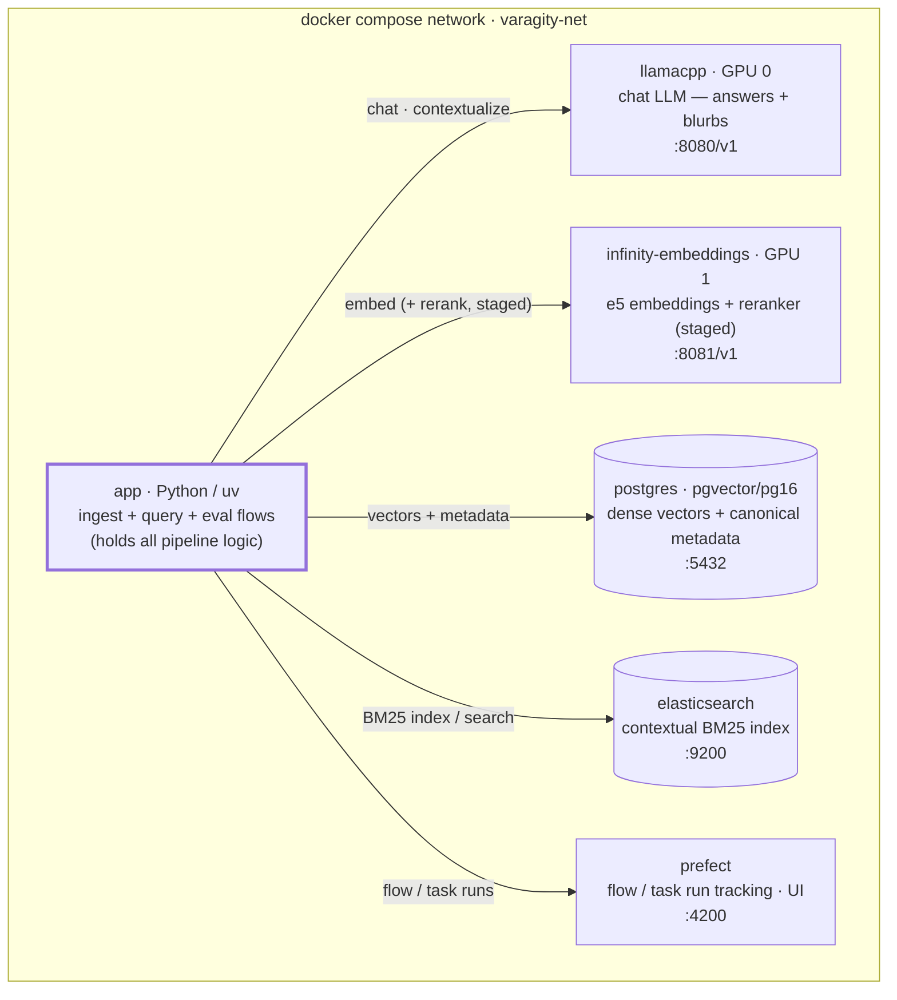
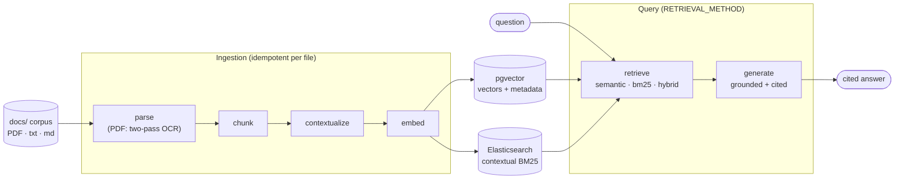
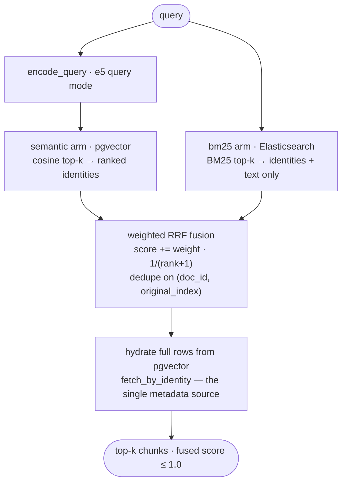

# Architecture

Varagity is a self-hosted RAG system implementing Anthropic-style **Contextual
Retrieval**. Everything runs locally under one Docker Compose stack: models on
the host's GPUs, stores in containers, and a terminal app that ingests a corpus
and answers questions with grounded, cited answers.

This page describes the system **as built** (the forward-looking design is
[`spec.md`](https://github.com/luisegarduno/varagity/blob/main/spec.md) at the
repository root).

## Service topology

Six services, one network (`varagity-net`). The Python **app** is a client of
every backing service and holds all pipeline logic; the services never talk to
each other.

Every arrow starts at `app`: it is the sole client, and the services never
talk to each other.



| Service | Image | Role | GPU |
|---|---|---|---|
| `llamacpp` | `ghcr.io/ggml-org/llama.cpp:server-cuda` | Chat LLM (answers + contextualization blurbs), OpenAI-compatible `/v1`, model `.gguf` bind-mounted from the host | GPU 0 |
| `infinity-embeddings` | `michaelf34/infinity:0.0.76-trt-onnx` | `multilingual-e5-large-instruct` embeddings (1024-dim) **and** `bge-reranker-v2-m3` at `/v1/rerank` (served, not yet wired — see below) | GPU 1 |
| `postgres` | `pgvector/pgvector:pg16` | Dense vector store + the canonical chunk metadata (see [Data model](data-model.md)) | — |
| `elasticsearch` | `elasticsearch:9.2.0` | Contextual BM25 index (single-node, `yellow` by design) | — |
| `prefect` | `prefecthq/prefect:3-latest` | Flow/task run tracking; UI at `:4200`; SQLite backing store (ADR-003) | — |
| `app` | local `Dockerfile` (uv, non-root) | The Varagity CLI: `ingest`, `chat` (default), `eval` | — |

GPU pinning, VRAM budgets, and healthcheck semantics are operational concerns —
see the [runbook](runbook.md).

## Why Contextual Retrieval

A chunk embedded in isolation loses its parent document's context ("the company
grew 3%" — *which* company, *which* period?), causing retrieval misses. Anthropic's
[Contextual Retrieval](https://www.anthropic.com/news/contextual-retrieval)
fixes this by prepending an LLM-generated situating blurb to each chunk before
indexing. Their measured ladder of retrieval-failure reduction:

1. **≈35%** — contextual *embeddings* alone,
2. **≈49%** — contextual embeddings **+ contextual BM25** ← **v1 ships here**,
3. **≈67%** — the above + reranking (post-v1; see below).

Concretely, per chunk at ingest time
(`varagity/context/contextual.py`):

- the LLM sees the *whole document* and the chunk under the verbatim Anthropic
  cookbook prompt and returns a short situating blurb (`context`);
- `contextualized_content = context + "\n\n" + content` is what gets **embedded**
  (pgvector) **and BM25-indexed** (Elasticsearch); the original `content` is
  preserved alongside;
- a document's chunks are contextualized sequentially so llama.cpp reuses its
  prompt cache across the shared document preamble (throughput, not billing).

`CONTEXTUALIZE=false` keeps the identity path (`contextualized_content =
content`) — the measured non-contextual baseline of the
[eval matrix](pipelines.md#evaluation-flows) and a throughput knob.

## The two pipelines

Both live in the app and are Prefect-tracked (task graphs in
[Pipelines](pipelines.md)). At the system level they meet at the two stores —
ingest writes both, query reads both:



- **Ingestion** — `discover → parse → chunk → contextualize → embed →
  store(pgvector + Elasticsearch)`. Idempotent per file (byte-hash keyed);
  a two-pass Docling parser OCRs scanned PDFs automatically.
- **Query** — `embed(query) → retrieve → generate → display`. Retrieval method
  is config-selected (`RETRIEVAL_METHOD`): `semantic` (pgvector cosine), `bm25`
  (Elasticsearch), or `hybrid` (weighted reciprocal-rank fusion of both — the
  v1 default).

## The identity thread: `(doc_id, original_index)`

Chunks live in **two** stores that must agree on identity. The whole system
joins on one composite key:

```
doc_id         = sha256(relative_path + ":" + sha256(file_bytes))[:16]   (per document)
chunk_id       = f"{doc_id}::{chunk_index}"                              (per chunk, pg PK / ES _id)
original_index = global monotonic chunk counter across the corpus        (fusion key)
```

- `doc_id` hashes the path **relative to `DOCS_PATH`**, not the absolute path
  (ADR-003): absolute paths differ between host and container and across
  machines, which would break idempotency and make golden eval sets
  non-portable. The absolute path is still stored as `source` provenance.
- Hybrid fusion scores and dedupes on `(doc_id, original_index)`; the BM25 arm
  returns only identity + text, and full rows are **hydrated** from pgvector by
  the same key (`ContextualVectorDB.fetch_by_identity`).
- The golden eval set resolves to `chunk_id`s from corpus files alone — no
  store round-trip — because the derivation is pure.
- A unique index `chunks(doc_id, original_index)` enforces the identity in
  PostgreSQL so ingest bugs surface as constraint violations, not silent
  retrieval weirdness.

Hybrid retrieval is where the composite key earns its keep — two independent
ranked lists fuse and dedupe on it, then full rows are hydrated from pgvector:



## Modularity: the registry pattern

Anything expected to have "dozens of" implementations is a directory where each
file is one implementation, self-registered via a decorator and selected by an
`.env` value — adding one means adding a file plus its import line, with zero
caller edits:

| Family | Registry | Selected by | v1 implementations |
|---|---|---|---|
| Parsers | `varagity/ingest/parsers/base.py` | discovery bucket | `text` (`.txt`/`.md`), `pdf` (Docling two-pass) |
| Chunking strategies | `varagity/chunking/base.py` | `CHUNKING_STRATEGY` | `recursive_character` |
| Retrievers | `varagity/retrieval/base.py` | `RETRIEVAL_METHOD` | `semantic`, `bm25`, `hybrid` |
| OCR engines | `varagity/ingest/parsers/pdf.py` (factory) | `OCR_ENGINE` | `easyocr` (default, ADR-004), `tesseract` |
| Model clients | `varagity/models/registry.py` | `model_type` argument | `embedding`, `default` (+ `reasoning`/`tool` aliases) |

## Cross-cutting conventions

- **Three output channels** (never conflated): the `verbose: int` parameter
  (0/1/2) renders human-facing console output via `rich` helpers in
  `varagity/debug/show.py`; stdlib `logging` (one logger per module, configured
  only in `logging_setup.py`) carries persistent leveled logs; Prefect run logs
  carry pipeline observability.
- **Typed settings**: modules read the `pydantic-settings` `Settings` object
  (`varagity/config.py`), never `os.getenv`. Validation fails fast (fusion
  weights must sum to 1.0, `RETRIEVAL_METHOD` vocabulary, verbosity domain…).
- **Retries in layers**: every model/store client retries transient HTTP
  failures internally (`tenacity`); ingest's model/store *tasks* additionally
  carry Prefect retries for whole-stage re-runs (safe — both store writes are
  idempotent). Interactive query tasks deliberately carry none.
- **Docstrings are load-bearing**: every public module/class/function carries a
  Google-style docstring, machine-enforced by ruff's pydocstyle rules and
  rendered into the [API reference](reference/index.md) by mkdocstrings.

## Deferred, but staged: reranking

Reranking (the ≈67% tier) is **not part of the v1 query path**. The
infrastructure is already in place, though: the infinity container serves
`BAAI/bge-reranker-v2-m3` at `/v1/rerank` alongside the embedding model, and
`.env.example` stages the `RERANK_*` settings with `RERANK_ENABLED=false`.
Wiring it in is a post-v1 change that slots in after hybrid fusion — a new
registry file in `varagity/retrieval/`, no caller edits. Operational notes on
serving both models on one 8 GB GPU are in the
[runbook](runbook.md#the-reranker-rides-the-embedding-container).

## Module map

```
varagity/
├── config.py            # typed Settings (.env), validation
├── logging_setup.py     # RichHandler root config (the only place logging is configured)
├── tokens.py            # cl100k token counting (documented approximation)
├── models/              # OpenAI-SDK clients for llama.cpp + infinity, get_model() factory
├── ingest/
│   ├── discovery.py     # scan DOCS_PATH, bucket by parser family
│   ├── loader.py        # the single orchestration loop (idempotency, guards, dual-write)
│   └── parsers/         # text.py, pdf.py (Docling two-pass + OCR engine factory)
├── chunking/            # recursive_character (400 chars / 50 overlap)
├── context/             # situate_context() — the contextual blurb
├── stores/              # records.py (ChunkRecord), vector_store.py, bm25_store.py, schema.sql
├── retrieval/           # semantic.py, bm25.py, hybrid.py (+ hydrate)
├── generation/          # answer.py — context prompt + grounded generation + QueryState
├── pipeline/            # Prefect flows: ingest, query, eval (thin @task adapters)
├── eval/                # golden set, recall@k/pass@k matrix, OCR benchmark, testcontainers
├── cli/                 # argparse subcommands: ingest / chat / eval [ocr]
└── debug/show.py        # v_<name>() rich renderers behind the verbose= convention
```
