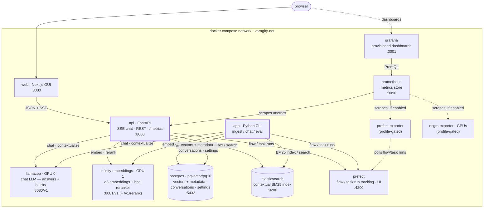
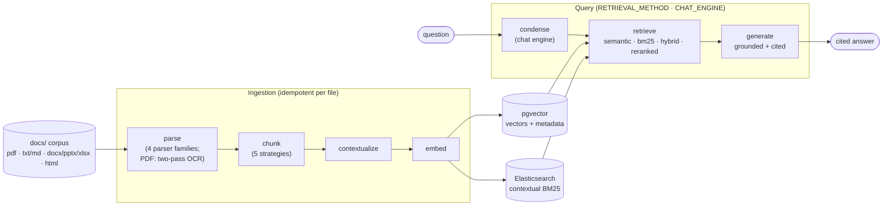

# Architecture

Varagity is a self-hosted RAG system implementing Anthropic-style **Contextual
Retrieval**. Everything runs locally under one Docker Compose stack: models on
the host's GPUs, stores in containers, and one Python pipeline package with
two peer front-ends — a terminal CLI and a FastAPI service backing the Next.js
web GUI — that ingest a corpus and answer questions with grounded, cited
answers.

This page describes the system **as built**. The forward-looking designs —
`spec.md` (v1), `spec_v2.md` (v2), and `spec_v3.md` (v3), the documents the
`§` references in docstrings point at — are untracked working papers under
`thoughts/shared/specs/`.

## Service topology

Ten default services, one network (`varagity-net`), plus two profile-gated
metric exporters. All pipeline logic lives in the `varagity` Python package,
which reaches the five backing services from **two peer front-ends**: the
`app` CLI and the `api` service. The remaining service-to-service edges are
few and directional: the browser talks to `web` (and, optionally, Grafana),
`web` talks only to `api`, Prometheus scrapes `api`'s `/metrics` (plus the
optional exporters), and Grafana queries Prometheus.



| Service | Image / build | Role | Host port | GPU |
|---|---|---|---|---|
| `llamacpp` | `ghcr.io/ggml-org/llama.cpp:server-cuda` | Chat LLM (answers + contextualization blurbs), OpenAI-compatible `/v1`, model `.gguf` bind-mounted from the host | `8080` | GPU 0 (`count: 1`) |
| `infinity-embeddings` | `michaelf34/infinity:0.0.76-trt-onnx` | `multilingual-e5-large-instruct` embeddings (1024-dim) **and** `bge-reranker-v2-m3` at `/v1/rerank`, wired into the query path (see [Reranking](#reranking-wired-in-v2)) | `8081` (single-interface binding) | GPU 1 (`device_ids: ["1"]`) |
| `postgres` | `pgvector/pgvector:pg16` | Dense vectors + the canonical chunk metadata, plus the v2 conversation and settings tables (see [Data model](data-model.md)) | `5432` | — |
| `elasticsearch` | `docker.elastic.co/elasticsearch/elasticsearch:9.2.0` | Contextual BM25 index (single-node, `yellow` by design) | `9200` (+ `9300`) | — |
| `prefect` | `prefecthq/prefect:3-latest` | Flow/task run tracking; UI at `:4200`; SQLite backing store (ADR-003) | `4200` | — |
| `api` | local `Dockerfile.api` (uv, single uvicorn worker) | FastAPI (`varagity/api/`): SSE chat streaming, conversation CRUD, corpus + settings routes, `/metrics`; invokes the Prefect flows in-process | `8000` | — |
| `web` | local `web/Dockerfile` (`NEXT_PUBLIC_API_URL` baked at **build** time) | The Next.js GUI — the only browser-facing app surface; talks only to `api` | `3000` | — |
| `prometheus` | `prom/prometheus:v3.13.1` | Scrapes `api:/metrics` every 15 s, plus the optional exporters | `${PROMETHEUS_PORT:-9090}` | — |
| `grafana` | `grafana/grafana:12.3.8` | Dashboards-as-code: provisioned Prometheus datasource + Query/Ingestion/Infra dashboards; anonymous read-only viewing (dev posture) | `${GRAFANA_PORT:-3001}` → `3000` | — |
| `app` | local `Dockerfile` (uv, non-root) | The Varagity CLI: `ingest`, `chat` (default), `eval` | — | — |

Two exporters ship **profile-gated** (off by default; their Prometheus scrape
jobs are always configured, so a disabled profile just shows `up == 0`):

| Service | Image | Enable with | Role |
|---|---|---|---|
| `prefect-exporter` | `prefecthq/prometheus-prefect-exporter:3.6.1` | `docker compose --profile prefect-exporter up -d` | Flow/task-run metrics polled from the Prefect API; scraped in-network at `:8000` (no host port — `api` owns host 8000) |
| `dcgm-exporter` | `nvidia/dcgm-exporter:4.5.2-4.8.1-ubuntu22.04` | `docker compose --profile gpu-metrics up -d` | GPU VRAM/utilization via NVIDIA DCGM; scraped in-network at `:9400` |

GPU pinning, VRAM budgets, and healthcheck semantics are operational concerns —
see the [runbook](runbook.md).

### Two peer front-ends, one pipeline package

The CLI (`app`) and the API (`api`) are **peers over the same in-process
Prefect flows** — neither wraps the other, and there are no Prefect workers or
deployments. The web app holds no pipeline logic at all: it is a pure client
of `api` (JSON + SSE), which is what keeps the frontend swappable (spec_v2 §3).

The API is **async at the edge, sync underneath** (spec_v2 §4.1): FastAPI
handlers are async, but they run the unchanged synchronous flows in a
threadpool and marshal streaming callbacks back onto the event loop — no
pipeline code was rewritten to async. `varagity/api/schemas.py` is the wire
contract (the web app's TypeScript types are generated from the OpenAPI
schema, never hand-edited), and the chat SSE protocol is
`retrieval → reasoning/token deltas → done` (or an in-band `error`) —
evidence always arrives before prose. Task graphs and streaming details are
in [Pipelines](pipelines.md).

The api service also owns the evidence panel's **page previews**
([ADR-010](adr/ADR-010-document-page-preview.md)): for chunks from digital
PDFs and PPTX decks, `varagity/preview/` locates the one source page
containing the chunk at *preview time* (word-trigram page scoring + pdfium
text-search highlight rects — no ingest-time provenance, no reingest) and
serves it as an immutably-cacheable PNG, with PPTX decks converted once per
container lifetime by headless LibreOffice inside the api image. Every
failure mode degrades to the GUI's full-text view via an
`available:false` + `reason` envelope — the path never 500s per document.

## Why Contextual Retrieval

A chunk embedded in isolation loses its parent document's context ("the company
grew 3%" — *which* company, *which* period?), causing retrieval misses. Anthropic's
[Contextual Retrieval](https://www.anthropic.com/news/contextual-retrieval)
fixes this by prepending an LLM-generated situating blurb to each chunk before
indexing. Their measured ladder of retrieval-failure reduction:

1. **≈35%** — contextual *embeddings* alone,
2. **≈49%** — contextual embeddings **+ contextual BM25** ← v1 shipped here
   (the `hybrid` default),
3. **≈67%** — the above + **reranking** ← **v2 ships here**
   (`RETRIEVAL_METHOD=reranked` — see [Reranking](#reranking-wired-in-v2)).

Concretely, per chunk at ingest time
(`varagity/context/contextual.py`):

- the LLM sees the *whole document* and the chunk under the verbatim Anthropic
  cookbook prompt and returns a short situating blurb (`context`);
- `contextualized_content = context + "\n\n" + content` is what gets **embedded**
  (pgvector) **and BM25-indexed** (Elasticsearch); the original `content` is
  preserved alongside;
- a document's chunks are contextualized sequentially so llama.cpp reuses its
  prompt cache across the shared document preamble (throughput, not billing).

`CONTEXTUALIZE=false` keeps the identity path (`contextualized_content =
content`) — the measured non-contextual baseline of the
[eval matrix](pipelines.md#evaluation-flows) and a throughput knob.

## The two pipelines

Both live in the `varagity` package and are Prefect-tracked (task graphs in
[Pipelines](pipelines.md)). At the system level they meet at the two stores —
ingest writes both, query reads both:



- **Ingestion** — `discover → parse → chunk → contextualize → embed →
  store(pgvector + Elasticsearch)`. Idempotent per file (byte-hash keyed).
  Four parser families cover PDF (a two-pass Docling parse that OCRs scanned
  pages automatically), plain text/markdown, office
  (`.docx`/`.pptx`/`.xlsx`), and web (`.html`/`.htm`); the chunking strategy
  is config-selected from five registered implementations.
- **Query** — `condense → embed(search query) → retrieve → generate →
  display`. The condense stage is v3's **chat engine** (`CHAT_ENGINE`,
  [ADR-011](adr/ADR-011-chat-engine-condense.md)): given the turn and its
  conversation history it decides *what string the retriever searches with* —
  `simple` (the default) passes the question through verbatim;
  `condense_context` rewrites a follow-up into a standalone query. The split
  is the invariant: the engine's `search_query` drives the query embedding
  and BM25 while the **original** question always reaches the answer prompt.
  Retrieval method is config-selected (`RETRIEVAL_METHOD`): `semantic`
  (pgvector cosine), `bm25` (Elasticsearch), `hybrid` (weighted
  reciprocal-rank fusion of both — the default), or `reranked` (a base
  method's candidates re-ordered by a cross-encoder — see
  [below](#reranking-wired-in-v2)). The API front-end runs the same path as a
  streaming flow (`query-stream`), delivering evidence and answer deltas over
  SSE.

Since v2 every retrieved chunk carries an optional **`RetrievalTrace`** —
per-arm ranks and scores, fused score and rank, rerank delta, final rank —
threaded through fusion and hydration and filled in by the rerank stage
(spec_v2 §9.2). The CLI matches table (`-v 2`), the web evidence panel, and
the persisted `message_sources.trace` snapshots all render that same record;
field-level documentation is in the
[data model](data-model.md#the-retrievaltrace).

## The identity thread: `(doc_id, original_index)`

Chunks live in **two** stores that must agree on identity. The whole system
joins on one composite key:

```
doc_id         = sha256(relative_path + ":" + sha256(file_bytes))[:16]   (per document)
chunk_id       = f"{doc_id}::{chunk_index}"                              (per chunk, pg PK / ES _id)
original_index = global monotonic chunk counter across the corpus        (fusion key)
```

- `doc_id` hashes the path **relative to `DOCS_PATH`**, not the absolute path
  (ADR-003): absolute paths differ between host and container and across
  machines, which would break idempotency and make golden eval sets
  non-portable. The absolute path is still stored as `source` provenance.
- Hybrid fusion scores and dedupes on `(doc_id, original_index)`; the BM25 arm
  returns only identity + text, and full rows are **hydrated** from pgvector by
  the same key (`ContextualVectorDB.fetch_by_identity`).
- The golden eval set resolves to `chunk_id`s from corpus files alone — no
  store round-trip — because the derivation is pure.
- A unique index `chunks(doc_id, original_index)` enforces the identity in
  PostgreSQL so ingest bugs surface as constraint violations, not silent
  retrieval weirdness.

Hybrid retrieval is where the composite key earns its keep — two independent
ranked lists fuse and dedupe on it, then full rows are hydrated from pgvector:


Since v2, fusion keeps its receipts: `fuse_with_traces` — the trace-building
sibling of `fuse`, delegating the identical fusion math — preserves the
per-arm rank/score maps that `fuse` builds and discards into a per-survivor
[`RetrievalTrace`](data-model.md#the-retrievaltrace), which `hydrate` attaches
to each returned chunk (spec_v2 §9.2).

## Modularity: the registry pattern

Anything expected to have "dozens of" implementations is a directory where each
file is one implementation, self-registered via a decorator and selected by an
`.env` value — adding one means adding a file plus its import line, with zero
caller edits:

| Family | Registry | Selected by | Implementations |
|---|---|---|---|
| Parsers | `varagity/ingest/parsers/base.py` | discovery bucket | `text` (`.txt`/`.md`), `pdf` (Docling two-pass OCR), `office` (`.docx`/`.pptx`/`.xlsx`), `web` (`.html`/`.htm`) |
| Chunking strategies | `varagity/chunking/base.py` | `CHUNKING_STRATEGY` | `recursive_character` (default — [ADR-008](adr/ADR-008-chunking-default.md)), `token_based`, `markdown_aware`, `semantic`, `docling_hybrid` |
| Retrievers | `varagity/retrieval/base.py` | `RETRIEVAL_METHOD` | `semantic`, `bm25`, `hybrid`, `reranked` |
| Chat engines | `varagity/chat/base.py` | `CHAT_ENGINE` | `simple` (default — [ADR-011](adr/ADR-011-chat-engine-condense.md)), `condense_context` |
| OCR engines | `varagity/ingest/parsers/pdf.py` (a factory, deliberately not a registry) | `OCR_ENGINE` | `easyocr` (default, ADR-004), `tesseract` |
| Model clients | `varagity/models/registry.py` | `model_type` argument | `embedding`, `rerank`, `default` (+ `reasoning`/`tool` aliases) |

The `office` and `web` parsers share an *unregistered* Docling core
(`parsers/docling_base.py`) — shared machinery stays a plain module; only
selectable implementations register.

## Cross-cutting conventions

- **Three output channels** (never conflated): the `verbose: int` parameter
  (0/1/2) renders human-facing console output via `rich` helpers in
  `varagity/debug/show.py`; stdlib `logging` (one logger per module, configured
  only in `logging_setup.py`) carries persistent leveled logs; Prefect run logs
  carry pipeline observability.
- **Typed settings**: modules read the `pydantic-settings` `Settings` object
  (`varagity/config.py`), never `os.getenv`. Validation fails fast (fusion
  weights must sum to 1.0, `RETRIEVAL_METHOD` vocabulary, the rerank bounds,
  verbosity domain…). The API additionally layers persisted
  [runtime overrides](data-model.md#runtime-settings-overrides) over the env
  values through that same object.
- **Retries in layers**: every model/store client — the rerank client
  included — retries transient HTTP failures internally (`tenacity`); ingest's
  model/store *tasks* additionally carry Prefect retries for whole-stage
  re-runs (safe — both store writes are idempotent). Interactive query tasks
  deliberately carry none.
- **Docstrings are load-bearing**: every public module/class/function carries a
  Google-style docstring, machine-enforced by ruff's pydocstyle rules and
  rendered into the [API reference](reference/index.md) by mkdocstrings.

## Reranking (wired in v2)

Reranking — the ≈67% tier — is wired into the query path as the `reranked`
retriever (`varagity/retrieval/reranked.py`; spec_v2 §5,
[ADR-006](adr/ADR-006-reranking-wired.md)). It **composes** a base retriever
rather than forking fusion:

1. over-fetch a wide candidate pool from `RERANK_BASE_METHOD` (default
   `hybrid`) — `max(RERANK_CANDIDATES, k)` chunks, default pool 40;
2. cross-encode every candidate's original `content` against the query with
   `bge-reranker-v2-m3` at infinity's `/v1/rerank` (the contextual blurb
   already did its job at the embedding/BM25 stage);
3. keep the `min(k, RERANK_TOP_N)` most relevant, recording `rerank_score` and
   `rerank_delta` on each chunk's trace.

`RERANK_ENABLED=false` is a **kill switch, not a method**:
`RETRIEVAL_METHOD=reranked` then degrades to its base method's ranking and
logs the degradation. Method selection and the toggle are deliberately
orthogonal — the GUI toggle and the eval baseline both work without renaming
the method. Operational notes on serving the reranker and the embedder from
one 8 GB GPU are in the
[runbook](runbook.md#the-reranker-rides-the-embedding-container).

## Module map

```
varagity/
├── config.py             # typed Settings (.env + persisted runtime overrides), validation
├── logging_setup.py      # RichHandler root config (the only place logging is configured)
├── tokens.py             # cl100k token counting (documented approximation)
├── models/               # OpenAI-SDK clients for llama.cpp + infinity; get_model() factory
│   ├── rerank.py         # RerankClient — infinity /v1/rerank (cross-encoders only)
│   └── stream.py         # ThinkStreamSplitter — reasoning vs answer delta classification
├── ingest/
│   ├── discovery.py      # scan DOCS_PATH, bucket by parser family
│   ├── loader.py         # the single orchestration loop (idempotency, guards, dual-write)
│   └── parsers/          # text.py, pdf.py (two-pass OCR + engine factory),
│                         #   docling_base.py (shared core), office.py, web.py
├── chunking/             # recursive_character (default), token_based, markdown_aware,
│                         #   semantic, docling_hybrid
├── context/              # situate_context() — the contextual blurb
├── stores/
│   ├── records.py        # ChunkRecord, RetrievalTrace, RetrievedChunk
│   ├── vector_store.py, bm25_store.py, schema.sql
│   ├── conversation_store.py   # conversations / messages / message_sources snapshots
│   ├── app_settings_store.py   # persisted runtime overrides + the _corpus_stale flag
│   └── migrate.py, migrations/ # idempotent NNN_*.sql runner (runs on API startup)
├── retrieval/            # semantic.py, bm25.py (+ hydrate), hybrid.py, reranked.py
├── chat/                 # chat-engine registry (ADR-011): base.py (PreparedQuery, Turn),
│                         #   simple.py, condense.py + prompts.py
├── preview/              # evidence-panel page previews (ADR-010): normalize, locate
│                         #   (pdfium, one global lock), render, source gate, pptx→pdf
├── generation/           # answer.py — context prompt + grounded generation + QueryState
├── pipeline/             # Prefect flows: ingest, query, query-stream, eval (thin @task adapters)
├── observability/        # metrics.py (the Prometheus collector catalog, spec_v2 §6.2)
│                         #   + corpus.py (store-derived corpus gauges — ADR-013)
├── api/                  # the FastAPI front-end (spec_v2 §4)
│   ├── main.py           # app factory + lifespan (migrations, override replay)
│   ├── routes/           # system, conversations, chat, settings, documents, ingest, metrics
│   ├── schemas.py        # the wire contract (REST + SSE payloads → generated TS types)
│   ├── streaming.py      # EventBridge — sync flow callbacks → SSE frames
│   ├── ingest_runner.py  # one-at-a-time background ingest + status stream replay
│   └── runtime_settings.py, deps.py
├── eval/                 # golden set, 5-config matrix, chunker sweep, OCR benchmark, testcontainers
├── cli/                  # argparse subcommands: ingest / chat / eval [ocr]
└── debug/show.py         # v_<name>() rich renderers behind the verbose= convention

web/                      # the Next.js GUI — own toolchain (bun, Vitest, Playwright); talks only to api
observability/            # prometheus.yml + provisioned Grafana datasource/dashboards (mounted read-only)
```
