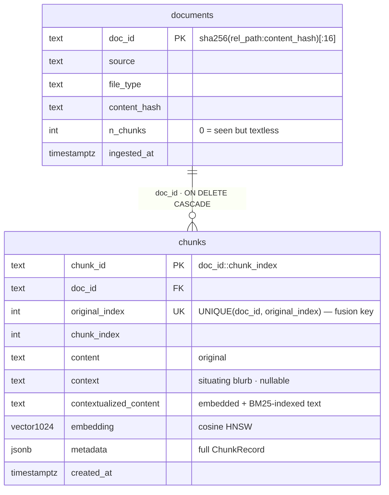
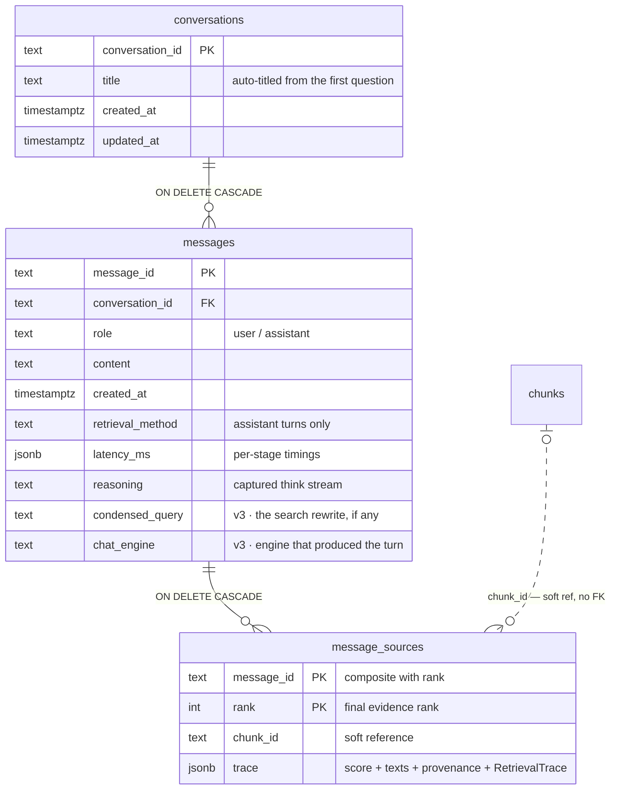
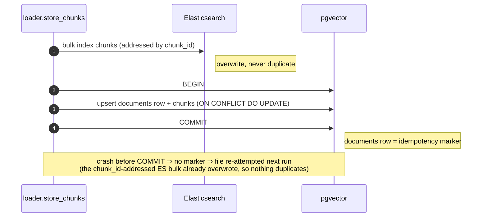

# Data model

Storing complete, queryable metadata for every chunk is a hard requirement
(spec §8). This page documents the schema **as built**, including the two
deliberate v1 amendments over the spec: the relative-path `doc_id` and the
unique identity index (both ADR-003). v2's changes are **additive**
(spec_v2 §9): the chunk/vector tables keep their shape; conversation
persistence and runtime-settings tables arrive through the
[migration runner](#schema-migrations), and query-time rank provenance rides
the [`RetrievalTrace`](#the-retrievaltrace) — a record that is never stored on
chunk rows.

## Identity derivation

Implemented in `varagity/stores/records.py`:

```
content_hash = sha256(file_bytes)                                  # bytes, not parsed text
doc_id       = sha256(f"{relative_path}:{content_hash}")[:16]      # path relative to DOCS_PATH
chunk_id     = f"{doc_id}::{chunk_index}"
```

- **`content_hash` hashes raw bytes** so unchanged files are skipped *before*
  paying the parse cost, and so `doc_id` is stable across OCR engines (bytes,
  not extracted text).
- **`doc_id` hashes the relative path** (spec §8.1 said absolute). Absolute
  paths differ between host (`/home/…/docs/a.md`) and container
  (`/app/docs/a.md`) and across machines — hashing them would break
  idempotency and make golden eval sets non-portable. The absolute path is
  still recorded in `source`.
- **`(doc_id, original_index)`** is the cross-store join/fusion identity;
  `original_index` is a global monotonic counter allocated per ingest run
  (`SELECT COALESCE(MAX(original_index), -1) + 1`, then incremented
  in-process).

## Chunk metadata (`ChunkRecord`)

Every chunk persists this record (pydantic-validated; stored whole in the
`chunks.metadata` JSONB column and mirrored into typed columns where queried):

| Field | Type | Description |
|---|---|---|
| `doc_id` | str | Stable per-document id (see above) |
| `chunk_id` | str | `f"{doc_id}::{chunk_index}"` — pg primary key and ES `_id` |
| `original_index` | int | Global monotonic chunk index (fusion key) |
| `chunk_index` | int | Chunk position within its document |
| `source` | str | Absolute file path (provenance only — never identity) |
| `file_name` | str | Basename |
| `file_type` | str | File extension without the dot: `pdf` / `txt` / `md` / `docx` / `pptx` / `xlsx` / `html` / `htm` |
| `page` | int? | First page that contributed text (Docling-parsed formats; `None` otherwise)¹ |
| `content` | str | **Original** chunk text |
| `context` | str? | LLM situating blurb (`None` when ingested with `CONTEXTUALIZE=false`) |
| `contextualized_content` | str | `context + "\n\n" + content` — the text actually embedded & BM25-indexed; equals `content` when `context` is `None` |
| `chunk_size` / `chunk_overlap` | int | Parameters used, **in the strategy's unit** — characters for `recursive_character`/`markdown_aware`, tokens for `token_based`/`docling_hybrid`/`semantic` (provenance) |
| `chunking_strategy` | str | Registry name of the chunker used, e.g. `recursive_character` |
| `embedding_model` | str | Served model name, e.g. `infloat/multilingual-e5-large-instruct` |
| `n_tokens` | int | Approximate token count of `content` (cl100k — a documented approximation; the e5 tokenizer differs) |
| `content_hash` | str | The parent document's byte hash |
| `created_at` | datetime | Ingestion timestamp (UTC) |
| `file_created_at` | datetime? | Filesystem birth time of the source file (UTC) — best-effort: `os.stat` exposes it on macOS/Windows; on Linux a GNU-coreutils `stat -c %W` fallback reads it, and `None` means the filesystem records none (a copy/download also resets it) |
| `file_modified_at` | datetime? | Filesystem mtime of the source file (UTC) — the **document's** clock, distinct from `created_at` (the ingest's). Uploads keep the original file's clock: the GUI sends `File.lastModified` and the upload route restamps the stored file's mtime. `None` only on pre-field rows (backfilled by the next reingest) |
| `extraction` | str | `"text"`, `"ocr"` (image parser — OCR is that format's only path), or `"ocr_fallback"` (the PDF pass-2 recovery) — **beyond spec §8.1**: extraction provenance for retrieval-quality debugging (OCR noise hits BM25 keyword matching hardest) |
| `heading_path` | str? | **v2**: markdown heading breadcrumb (e.g. `"Operations > Dredging"`) set by the heading-aware chunkers (`markdown_aware`, `docling_hybrid` — spec_v2 §7); `None` for strategies without structure. New `ChunkRecord` fields land in the `metadata` JSONB — no migration needed |

¹ `page` is document-level (the first page that contributed text), not
per-chunk: the shared chunker copies one `source_meta` per document, so
per-chunk page attribution has no data path yet. A future chunker with
`start_index` support plus a loader page-map lookup would make it per-chunk.
For the v2 office formats, Docling models `.pptx` slides and `.xlsx`/`.ods`
sheets as pages, so `page` carries a slide/sheet number there (`.odp` slides
expose no item provenance, so `page` stays `None`); an OCR'd image is a
one-page document, so `page` is `1` whenever text was recognized.

## The `RetrievalTrace`

Where `ChunkRecord` is ingest-time and immutable, the `RetrievalTrace`
(also `varagity/stores/records.py`; spec_v2 §9.2) is **query-time only** —
computed per answer by the retrievers and never persisted on the chunk rows.
It is the "why did this chunk rank here" record behind the web evidence panel
and the CLI's rank badges:

| Field | Type | Meaning |
|---|---|---|
| `semantic_rank` / `semantic_score` | int? / float? | Rank and cosine similarity in the semantic (pgvector) arm; `None` when that arm's ranked list never surfaced the chunk |
| `bm25_rank` / `bm25_score` | int? / float? | Rank and BM25 relevance in the Elasticsearch arm; `None` likewise |
| `fused_score` | float | Weighted reciprocal-rank fusion score (required) |
| `fused_rank` | int | Rank after fusion (required) |
| `rerank_score` | float? | Cross-encoder relevance; `None` when the rerank stage is off the path |
| `rerank_delta` | int? | Positions moved by reranking, `pre − post` (+ moved up / − moved down); `None` when off the path |
| `final_rank` | int | The rank actually returned to the caller |

Semantics and population:

- **All ranks are 1-based** (display-ready). Single-arm retrievers
  (`semantic`, `bm25`) report their arm's score/rank as the fused values —
  there is nothing to fuse.
- `hybrid.fuse_with_traces` builds the trace during fusion (preserving the
  per-arm rank/score maps that plain `fuse` discards; raw arm scores never
  enter the fusion math — they ride along for display only), and `hydrate`
  attaches it to each returned chunk with `final_rank == fused_rank`.
- `RerankedRetriever.apply_rerank` then overwrites `rerank_score`,
  `rerank_delta` (`pre_rank − final_rank`), and `final_rank` on the surviving
  candidates — the base retriever's arm and fused fields stay intact — and
  synthesizes a trace for any trace-less candidate.
- **Backward compatible**: `RetrievedChunk.trace: RetrievalTrace | None`
  defaults to `None`, so pre-trace callers (the eval harness, raw store
  search results) are unaffected.

Consumers: the CLI matches table (`-v 2` renders the badges
`sem #1 · bm25 #3 · fused 0.94 · rerank +2`), the web evidence panel, and —
for history — the [`message_sources.trace` snapshot](#conversation-persistence)
below.

## PostgreSQL schema

`varagity/stores/schema.sql`, mounted into the postgres container's
`/docker-entrypoint-initdb.d/` — it runs **only on first boot** (empty data
directory). Reset with `docker compose down -v` (see the
[runbook](runbook.md#volumes-and-resets)). It holds the chunk-side schema
below and stays the fresh-install fast path; the v2 tables (`conversations`,
`messages`, `message_sources`, `app_settings`) live in `migrations/` and
reach fresh and existing volumes alike through the
[migration runner](#schema-migrations).



```sql
CREATE EXTENSION IF NOT EXISTS vector;

-- one row per ingested source document (idempotency + provenance)
CREATE TABLE IF NOT EXISTS documents (
    doc_id        TEXT PRIMARY KEY,
    source        TEXT NOT NULL,
    file_type     TEXT NOT NULL,
    content_hash  TEXT NOT NULL,
    n_chunks      INT  NOT NULL,
    ingested_at   TIMESTAMPTZ NOT NULL DEFAULT now()
);

-- one row per chunk
CREATE TABLE IF NOT EXISTS chunks (
    chunk_id                TEXT PRIMARY KEY,
    doc_id                  TEXT NOT NULL REFERENCES documents(doc_id) ON DELETE CASCADE,
    original_index          INT  NOT NULL,
    chunk_index             INT  NOT NULL,
    content                 TEXT NOT NULL,          -- original
    context                 TEXT,                   -- LLM situating blurb
    contextualized_content  TEXT NOT NULL,          -- embedded/indexed text
    embedding               vector(1024) NOT NULL,  -- EMBEDDING_DIM
    metadata                JSONB NOT NULL,         -- full ChunkRecord (source, page, tokens, …)
    created_at              TIMESTAMPTZ NOT NULL DEFAULT now()
);

-- cosine HNSW index (e5 embeddings are normalized)
CREATE INDEX IF NOT EXISTS chunks_embedding_hnsw
    ON chunks USING hnsw (embedding vector_cosine_ops);

CREATE INDEX IF NOT EXISTS chunks_doc_id_idx ON chunks(doc_id);

-- (doc_id, original_index) is the fusion/join identity across pgvector and
-- Elasticsearch; enforcing uniqueness catches ingest bugs early.
CREATE UNIQUE INDEX IF NOT EXISTS chunks_doc_orig_uidx ON chunks(doc_id, original_index);
```

Notes:

- **Cosine, not L2**: e5 embeddings are L2-normalized, so search orders by
  `embedding <=> :qvec` (cosine distance) and reports
  `score = 1 - distance` (spec §11.2).
- **The unique identity index** is the one schema addition over spec §8.2
  (ADR-003): a duplicated `(doc_id, original_index)` would silently corrupt
  hybrid fusion, so it fails loudly at write time instead.
- **`n_chunks = 0` documents are deliberate**: a file with no extractable text
  still gets a `documents` row, so it is visibly "seen", cheaply re-warned on
  later runs without re-parsing, and re-attempted under `--reingest`. Files
  are never silently dropped.
- **Writes are upserts**: `ON CONFLICT (chunk_id) DO UPDATE` for chunks; the
  per-document write (`documents` row + all its chunks) is one transaction, so
  a partial failure leaves no idempotency marker and the next run re-attempts
  the file.

## Schema migrations

`schema.sql` runs only on the container's **first boot**, so schema added
after a `pgdata` volume exists would never reach it — the gotcha spec_v2 §9.3
exists to close. v2 adds a lightweight, idempotent migration runner
(`varagity/stores/migrate.py`) instead of a heavier dependency (Alembic is the
recorded fallback if migrations ever get non-trivial —
[ADR-005](adr/ADR-005-web-stack-and-api.md)):

- **Ordered files**: `varagity/stores/migrations/NNN_*.sql`, applied in
  filename order. A `.sql` file in that directory not matching
  `^\d{3}_[a-z0-9_]+\.sql$` fails the run loudly (`ValueError`) — a silently
  skipped migration is exactly the drift the runner exists to end.
- **Tracked**: applied filenames land in `schema_migrations (name TEXT
  PRIMARY KEY, applied_at TIMESTAMPTZ NOT NULL DEFAULT now())`, created on
  demand.
- **One transaction per file**: each unapplied migration runs together with
  its bookkeeping `INSERT` in a single transaction — a failing migration
  rolls back atomically and the next run re-attempts exactly that file.
- **Convergent**: every migration is written `IF NOT EXISTS`-safe, so the
  runner takes a fresh volume and a v1 volume to the same schema; re-running
  is a no-op.
- **Applied on API startup** (the `lifespan` in `varagity/api/main.py`, in a
  threadpool) — not by the CLI. An existing v1 `pgdata` volume therefore
  **gains the v2 tables on the next `api` boot, with no `docker compose
  down -v`** (see [Volumes and resets](runbook.md#volumes-and-resets)). An
  unreachable postgres at startup is tolerated (logged; the persistence
  routes 503 until it returns — the host-mode-without-stack case), but a SQL
  failure fails API startup: serving on a half-applied schema would be worse
  than not starting.

Current migrations: `001_conversations.sql` and `002_app_settings.sql` (the
next two sections), plus v3's `003_condensed_query.sql` and
`004_message_engine.sql` — two nullable `ALTER TABLE messages ADD COLUMN`s
for the chat engine's provenance snapshot
([below](#conversation-persistence)). `schema.sql` deliberately needed no
edit for 003/004: it holds only the v1 chunk-side tables — `messages` exists
solely in `001`, so both install paths (fresh volume and existing `pgdata`)
converge through the runner alone.

## Conversation persistence

Single-user chat history (spec_v2 §9.1) lives in the same Postgres as the
chunks — one datastore to operate — but in deliberately **independent**
tables, created by migration `001_conversations.sql`:

```sql
CREATE TABLE IF NOT EXISTS conversations (
    conversation_id  TEXT PRIMARY KEY,        -- app-generated id
    title            TEXT NOT NULL,           -- auto-titled from first question
    created_at       TIMESTAMPTZ NOT NULL DEFAULT now(),
    updated_at       TIMESTAMPTZ NOT NULL DEFAULT now()
);

CREATE TABLE IF NOT EXISTS messages (
    message_id       TEXT PRIMARY KEY,
    conversation_id  TEXT NOT NULL REFERENCES conversations(conversation_id) ON DELETE CASCADE,
    role             TEXT NOT NULL,           -- 'user' | 'assistant'
    content          TEXT NOT NULL,           -- question or generated answer
    created_at       TIMESTAMPTZ NOT NULL DEFAULT now(),
    -- assistant-only provenance snapshot (null for user turns):
    retrieval_method TEXT,
    latency_ms       JSONB,                   -- per-stage timings
    reasoning        TEXT                     -- captured <think> stream, if any
);

-- v3 (migrations 003/004): the chat-engine provenance snapshot — both
-- nullable, both assistant-only (ADR-011):
ALTER TABLE messages ADD COLUMN IF NOT EXISTS condensed_query TEXT;
ALTER TABLE messages ADD COLUMN IF NOT EXISTS chat_engine     TEXT;

CREATE TABLE IF NOT EXISTS message_sources (
    message_id       TEXT NOT NULL REFERENCES messages(message_id) ON DELETE CASCADE,
    rank             INT  NOT NULL,           -- final rank in the answer's evidence
    chunk_id         TEXT NOT NULL,           -- soft ref (survives reingest as a snapshot)
    trace            JSONB NOT NULL,          -- RetrievalTrace (§9.2) + score + content/context/source snapshot
    PRIMARY KEY (message_id, rank)
);

-- Transcript fetches read a conversation's messages in order.
CREATE INDEX IF NOT EXISTS messages_conversation_created_idx
    ON messages(conversation_id, created_at);
```



Notes:

- **`message_sources.trace` is a snapshot, not a join**
  (`ConversationStore._source_snapshot`): it persists `score`, `content`,
  `context`, `source`, `file_name`, `file_type`, `page`, `extraction`,
  `file_created_at`/`file_modified_at`, and the serialized
  [`RetrievalTrace`](#the-retrievaltrace) under `"trace"`
  (`null` when the retriever attached none) — everything the provenance
  panel renders. A historical conversation therefore still explains itself
  after a reingest replaces the chunk rows and changes `chunk_id`s.
- **`chunk_id` is deliberately a soft reference** — no FK to `chunks`. A hard
  FK would either cascade history away on reingest or block corpus
  maintenance; the id is kept purely as a record of *which* chunk backed the
  evidence at answer time.
- Assistant-turn provenance rides on `messages` itself: `retrieval_method`,
  per-stage `latency_ms` (JSONB), and the captured `<think>` stream in
  `reasoning` — all `NULL` for user turns.
- **v3 adds the chat-engine snapshot** (migrations 003/004;
  [ADR-011](adr/ADR-011-chat-engine-condense.md)): `condensed_query` is the
  standalone search query that actually drove retrieval — the evidence
  panel's "Searched for: …" line, live and on reload — and `chat_engine` is
  the registry name of the engine that produced the turn. `NULL`
  `condensed_query` means "not condensed" (a first turn, the `simple`
  engine, the kill switch, or the raw-query fallback); the engine name is
  persisted **even when degraded**, mirroring how `retrieval_method`
  persists `reranked` under `RERANK_ENABLED=false`. Same
  snapshot-over-reference rationale as `message_sources.trace`: the columns
  explain a historical answer, so they must outlive the settings that
  produced it.
- A turn is persisted in **one transaction** (`append_message`): the message,
  its `message_sources` rows (rank 1-based, best first), and the
  conversation's `updated_at` bump — a partial failure leaves no dangling
  turn. An aborted stream persists nothing.

## Runtime settings overrides

Migration `002_app_settings.sql` backs the GUI's live settings panel
(spec_v2 §4.7):

```sql
CREATE TABLE IF NOT EXISTS app_settings (
    key         TEXT PRIMARY KEY,
    value       TEXT NOT NULL,
    updated_at  TIMESTAMPTZ NOT NULL DEFAULT now()
);
```

- **One row per overridden `Settings` field**, keyed by the field name (e.g.
  `RETRIEVAL_METHOD`) with the value in its **env-string** form — exactly
  what pydantic-settings parses from the environment, so the override layer
  (`varagity/api/runtime_settings.py`) replays rows as process environment
  variables verbatim (env beats `.env`) and clears the settings cache. Every
  module that reads `get_settings()` — the repo-wide convention — sees the
  override on its next call.
- **Written by `PATCH /api/settings`**, which validates the *merged whole*
  through every config validator (the fusion-weight pair, the rerank bounds,
  the vocabularies) before persisting — an invalid patch changes nothing.
  **Replayed at API startup**, after the migration runner, so overrides
  survive an `api` restart; persisted rows that no longer validate are
  skipped with an error log (the API must boot on env defaults rather than
  crash).
- **Keys beginning `_` are reserved for app metadata** and never surface as
  overrides. The one in use is `_corpus_stale` — "a reingest-affecting
  setting changed since the last completed reingest" — set by
  `PATCH /api/settings` when such a setting actually changes on a non-empty
  corpus, cleared **only** by a completed API reingest (see
  [below](#idempotency-re-ingestion-semantics)).

## Elasticsearch index

`varagity/stores/bm25_store.py` (default index name
`varagity_contextual_bm25`). Mirrors the Anthropic cookbook's
`ElasticsearchBM25`: analyzed text fields under the built-in `english`
analyzer with BM25 similarity; identity fields stored but **not indexed**.

```json
{
  "settings": {
    "analysis": { "analyzer": { "default": { "type": "english" } } },
    "similarity": { "default": { "type": "BM25" } }
  },
  "mappings": { "properties": {
    "content":                { "type": "text",    "analyzer": "english" },
    "contextualized_content": { "type": "text",    "analyzer": "english" },
    "doc_id":                 { "type": "keyword", "index": false },
    "chunk_id":               { "type": "keyword", "index": false },
    "original_index":         { "type": "integer", "index": false }
  }}
}
```

Notes:

- **The index is contextual from its first document**: chunks are
  contextualized before they reach either store, and search is a
  `multi_match` over `content` **and** `contextualized_content`.
- **ES stores identity + text only.** Full records (source, page, context,
  metadata) are hydrated from pgvector by `(doc_id, original_index)` — pg is
  the single source of truth for metadata.
- **`"index": false` fields keep doc values**, so the term-level
  `delete_by_query` used by `--reingest` still works (a slower doc-values
  scan — fine at dev scale).
- **Documents are addressed by `chunk_id`** (`_id`), so re-indexing overwrites
  instead of duplicating — the sparse-side counterpart of the pg upsert.

## Idempotency & re-ingestion semantics

- A file whose `(doc_id, content_hash)` already exists in `documents` is
  skipped **before parsing**.
- Pipeline-setting changes (`CONTEXTUALIZE`, chunk params, `OCR_ENGINE`) do
  **not** change content hashes → unchanged files stay skipped. Re-process
  with `main.py ingest --reingest` (CLI) or `POST /api/ingest` with
  `reingest=true` (GUI) — both run the same flow, which deletes each
  discovered document from **both** stores (ES `delete_by_query` first, then
  the pg cascade delete) before ingesting fresh.
- **The GUI surfaces that footgun as a persisted flag** (v2): changing a
  reingest-affecting setting through `PATCH /api/settings`
  (`CHUNKING_STRATEGY`, `CHUNK_SIZE`, `CHUNK_OVERLAP`, `CONTEXTUALIZE`,
  `OCR_ENGINE`) on a non-empty corpus sets `_corpus_stale` in
  [`app_settings`](#runtime-settings-overrides), rendered as a "Re-ingest to
  apply" affordance. **Only a completed API reingest clears it** — a CLI
  `ingest --reingest` never touches the flag, and patching the setting back
  to its old value doesn't clear it either.
- The dual-write order is BM25 **first**, pgvector **last**: the pg
  `documents` row is the idempotency marker, so a failure between the two
  writes leaves no marker and the next run re-attempts the file (the
  `chunk_id`-addressed ES bulk then overwrites rather than duplicates).
- Removing a file from `docs/` does **not** remove its chunks — the ingest
  path has no corpus GC beyond `--reingest`. v2's
  `DELETE /api/documents/{doc_id}` closes that gap per document: ES delete
  first, then the pg cascade (the marker is deleted last, so a failed ES
  delete leaves the document visible and retryable), with opt-in source-file
  removal (`?remove_file=true`, honored only for paths inside `DOCS_PATH`;
  folders the unlink empties are pruned too, so deleting a folder upload's
  documents leaves no empty shells in the corpus directory).
  `POST /api/documents/delete` is the same operation over a set (the corpus
  table's multi-select): one `terms` `delete_by_query` and one
  `DELETE … WHERE doc_id = ANY(…)`, so the ordering — and therefore the
  retryability — holds set-wise, at one round trip per store rather than
  per document. Ids with no `documents` row come back in `not_found`
  instead of failing the batch, so a selection racing a concurrent delete
  still removes what remains.
- `GET /api/documents` reports each document's `relative_path` under
  `DOCS_PATH` (`null` for sources living elsewhere), and the GUI folds the
  corpus table back into the folders a folder upload created — collapsible
  rows whose checkbox and delete act on every descendant, so "delete a
  directory" is the same bulk delete over that folder's `doc_id`s, not a
  second delete path.

The write ordering that makes the `documents` row a reliable idempotency
marker — sparse store first, transactional store last:



## Golden eval dataset

`data/eval/golden_qa.jsonl` — one JSON object per line:

```json
{"query": "…", "relevant": [{"rel_source": "aurora_station.md", "chunk_index": 1, "fact": "4.2 megawatts"}]}
```

Relevant chunks are identified **portably** by `rel_source` (path relative to
the corpus root — exactly the string `doc_id` hashes) plus `chunk_index`, so
entries resolve to concrete `chunk_id`s from corpus files alone, on any
machine. `chunk_index` values assume the pinned eval chunk boundaries
(`recursive_character`, 400/50 — `PINNED_EVAL_SETTINGS`); re-author the golden
set if those pins change.

`fact` (v2) is the literal answer snippet the chunker sweep keys on
(spec_v2 §7.4): foreign chunk boundaries invalidate `chunk_index`, so the
sweep re-resolves each ref **by content** (`resolve_golden_by_fact`) — any
strategy-true chunk containing the fact satisfies the ref; index-anchored
scoring under foreign boundaries would measure nothing but the boundary
mismatch. Ground-truth transcriptions of the OCR fixture PDFs live in
`data/eval/ocr_truth/`.
