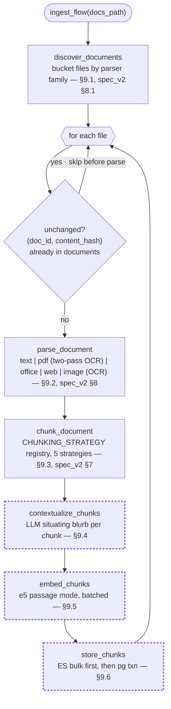
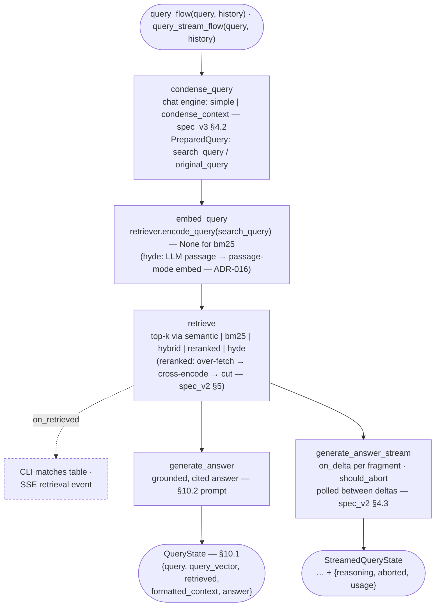
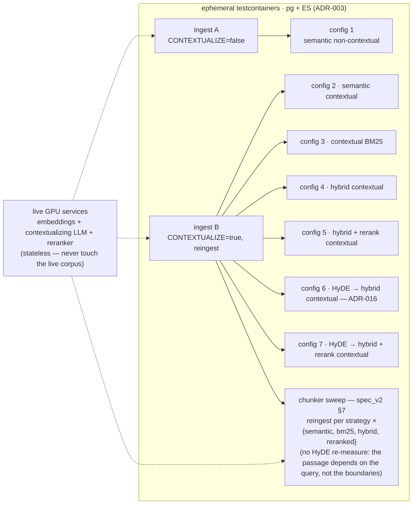

# Pipelines

Every pipeline is a Prefect flow (`varagity/pipeline/`) whose stages run as
tracked task runs — state, duration, retries, and logs per stage at the
Prefect UI (`http://localhost:4200`). Business logic lives in the plain
modules; the flow layer is thin `@task` adapters, so the same code runs with
or without Prefect. Two peer front-ends invoke the same flows in-process —
the CLI (`main.py`) and the HTTP API (`varagity/api/`, spec_v2 §4.9) — the
API adding streaming *around* the tasks, never forking them.

## Prefect posture

- **Flows run in-process** from the CLI and the API — no worker, deployment,
  or schedule (spec §21 #8). Every ingest/question/eval, terminal or
  browser, creates flow runs against the compose `prefect` server
  (SQLite-backed, ADR-003).
- **`PREFECT_API_URL` is exported before `prefect` is imported**
  (`varagity/pipeline/__init__.py`): Prefect captures its environment at
  import time, so a later export would be silently ignored. With no server
  reachable, Prefect 3 falls back to an ephemeral in-process API — host runs
  without the stack still work, just untracked.
- **Result caching is disabled on every task** (`NO_CACHE`): the stages are
  side-effecting calls against live services with unhashable inputs (store
  clients, progress displays); Prefect's default input-hash policy would log
  an error per run and a cache hit could never be correct.
- **Flow parameter validation is off** (`validate_parameters=False`): tests
  and the eval harness inject duck-typed store/client fakes that pydantic's
  is-instance validation would reject.
- **Flow bodies double as the Prometheus probe points** (spec_v2 §6.2): the
  query flows time each stage around its task call, record retrieval scores,
  and count outcomes; two ingest tasks carry the blurb-latency histogram and
  the corpus-growth counters (below). Recording is unconditional —
  `METRICS_ENABLED` gates only the API's `/metrics` route — but collectors
  are per-process, so only flows run *inside the API process* ever reach the
  scrape (see the [runbook](runbook.md#observability-operations)).

## Ingestion flow (`ingest`)

The three model/store stages (dashed border) carry Prefect `retries=2`;
discovery/parse/chunk are local and deterministic, so they carry none (below).

- **One orchestration loop.** The loader (`varagity/ingest/loader.py`) owns
  the loop — idempotency skip, empty-extraction guard, per-file failure
  containment, `original_index` allocation, file-clock provenance capture
  (`file_timestamps` → `file_created_at`/`file_modified_at` on every
  record) — and invokes each stage through
  an `IngestStages` seam. The flow passes `@task`-wrapped equivalents of the
  same stage functions through the same loop, so plain and tracked execution
  cannot drift. The task bundle is public (`TASK_STAGES`) — the API's ingest
  runner wraps these very tasks (below).
- **Five parser families, one loop** (spec_v2 §8, ADR-009). Discovery
  buckets each file: `.txt`/`.md`/`.rst` → `text`; `.pdf` → `pdf` (fast
  text-layer pass with the automatic OCR fallback pass —
  [runbook](runbook.md#ocr-fallback-operations)); the OOXML families,
  `.csv`, and OpenDocument → `office`; `.html`/`.htm`/`.xhtml` → `web`;
  bitmap images → `image` (no text layer exists, so OCR always runs and
  chunks carry `extraction: "ocr"`). Office and web share the PDF parser's
  Docling core but never OCR — their text is digital by construction, so
  every chunk carries `extraction: "text"`.
- **Five chunking strategies** (spec_v2 §7). `chunk_document` dispatches on
  `CHUNKING_STRATEGY`: `recursive_character` (the benchmark-kept default —
  ADR-008), `token_based`, `markdown_aware`, `semantic`, `docling_hybrid`.
  `CHUNK_SIZE`'s **unit is per-strategy**: characters for
  `recursive_character`/`markdown_aware`, tokens for
  `token_based`/`docling_hybrid` (and for `semantic`'s re-split ceiling —
  it splits on embedding-similarity boundaries, not a size budget).
  `markdown_aware` additionally stamps each chunk's `heading_path`
  breadcrumb (e.g. `Harbor Operations > Dredging`) into its metadata,
  carried by `ChunkRecord` into both stores.
- **Retries in two layers, different scopes.** The model/store clients retry
  transient HTTP failures *within* one call (`tenacity`); the
  contextualize/embed/store **tasks** carry `retries=2` with exponential
  backoff to re-run the whole stage after the client gives up — e.g. an
  Elasticsearch restart mid-ingest. Both store writes are idempotent, so a
  stage re-run is safe. Discovery/parse/chunk are local and deterministic;
  retrying them cannot help, so they carry none.
- **Failure containment.** One file raising is logged, counted (`failed` in
  the summary table), and visible as a failed task run — it never aborts the
  corpus. A file with no extractable text gets a 0-chunk `documents` row and
  a dedicated summary count (never silently dropped).
- **Ordering inside `store_chunks`**: Elasticsearch bulk first, pgvector
  transaction last — the pg `documents` row is the idempotency marker, so a
  failure in between leaves the file re-attemptable (see
  [Data model](data-model.md#idempotency-re-ingestion-semantics)).
- **Prometheus probe points**: `contextualize_chunks` feeds
  `varagity_contextualize_latency_seconds` per document (real blurb
  generation only — the `CONTEXTUALIZE=false` identity path doesn't count),
  and `store_chunks` bumps the document/chunk counters **after** both writes
  land, so corpus-growth metrics count documents that stored, not attempts.

### API-triggered ingest

`POST /api/ingest` runs **the same flow**: the API starts `ingest_flow` on a
daemon thread inside its own process and returns a run handle immediately
(202); `GET /api/ingest/status` streams the run as SSE (spec_v2 §4.2). The
runner (`varagity/api/ingest_runner.py`) wraps the flow's public
`TASK_STAGES` seam with event emitters — the Prefect tasks (tracking,
retries, metrics) are untouched; each stage transition just also emits a
frame. Tracking and streaming compose; there is no second pipeline.

- **Event protocol**: `status` (run snapshot — the first frame, and the
  terminal frame carrying the summary counters) · `progress` (one per
  `discover`/`parse`/`chunk`/`contextualize`/`embed`/`store`/`file_done`
  transition, plus **per-chunk contextualize ticks** via a proxy over the
  loader's `rich` progress handle — browser granularity equal to the
  terminal's on the ingest's long pole) · `log` (relayed `varagity.ingest`
  records: skips, no-text warnings, failures).
- **Replay from frame one**: events accumulate per run, and a subscriber
  always receives the full backlog before the live tail — connecting
  mid-run, or after completion, renders the same picture. An API process
  where nothing ever ran answers a single idle `status` frame and closes.
- **One run at a time**: a second `POST` while one is in flight is a
  structured `409 ingest_already_running`. A preflight rejects with a
  structured `503` when a required backing service is down (llamacpp is
  required only while `CONTEXTUALIZE` is on).
- **The stale-flag hook**: a *completed* `reingest=true` API run clears the
  persisted corpus-stale flag
  ([runbook](runbook.md#runtime-settings-the-stale-corpus-flag)); a CLI
  `ingest --reingest` runs in another process and does not.
- Because the flow runs in the API process, the ingest Prometheus counters
  actually reach the scrape — a CLI ingest records into a registry that dies
  with the process.

## Query flows (`query` / `query-stream`)

Both flows share the staging — condense → embed → retrieve → generate, with
`on_retrieved` firing between retrieve and generate — and return the spec
§10.1 state dict (which since v3 carries `prepared: PreparedQuery`);
`query_stream_flow` extends it as `StreamedQueryState` with `reasoning`,
`aborted`, and `usage`.

- **The condense stage is always in the graph** (v3, spec_v3 §4.2;
  [ADR-011](adr/ADR-011-chat-engine-condense.md)): `condense_query` runs the
  configured **chat engine** over the question and its conversation history
  and returns the `PreparedQuery` two-string split — everything downstream
  retrieves with `search_query` while the answer prompt always gets
  `original_query`, the user's verbatim words. Under `simple` (the default)
  it is the identity split in ~3 ms with no LLM call; `condense_context`
  makes one non-streaming LLM call to resolve a follow-up against history —
  and **falls back to the raw query** on any failure (empty, over-length, or
  a raised call — logged at `WARNING`, the turn never dies there). The first
  turn never condenses: empty history is the identity path.
- **Query embedding is its own tracked stage** via the retrievers'
  `encode_query()` seam; the vector is handed to `retrieve` so nothing is
  encoded twice. For `bm25` it is `None` (nothing to encode).
- **`reranked` composes inside `retrieve`** (spec_v2 §5, ADR-006) rather
  than adding a stage: it over-fetches a pool of `max(RERANK_CANDIDATES, k)`
  from `RERANK_BASE_METHOD` (default `hybrid`), cross-encodes every
  candidate's original `content` against the query at infinity's
  `/v1/rerank`, and keeps `top_n = min(k, RERANK_TOP_N)` — re-ranking
  narrows; it never invents candidates. Each survivor's `RetrievalTrace`
  gains `rerank_score`, `rerank_delta` (+ moved up / − moved down), and
  `final_rank` — the evidence panel's `rerank +2` badges — and its `score`
  becomes the cross-encoder relevance. **`RERANK_ENABLED=false` is a kill
  switch, not a method**: `reranked` then passes the base ranking through
  the same cut and logs the degradation. The rerank sub-stage is timed into
  Prometheus on its own (`stage="rerank"`), and the flow's `retrieve`
  observation deliberately *includes* it — total retrieval latency is what
  the user feels; rerank's share is subtractable.
- **`hyde` composes inside `encode_query`** (ADR-016): the embed stage's
  `retriever.encode_query(search_query)` is where the hypothetical answer
  passage is generated (one non-streaming LLM call, `<think>`-stripped via
  `clean_response` — the condense lesson) and embedded in e5 **passage
  mode**; `retrieve` then hands `HYDE_BASE_METHOD` the original query text
  plus that vector — dense-arm-only substitution, so a `hybrid` base's
  BM25 arm keeps exact keyword recall and traces pass through untouched.
  The generation sub-stage is timed into Prometheus on its own
  (`stage="hyde"`) and the flow's `embed` observation deliberately
  *includes* it, mirroring the rerank sub-stage. Every unusable generation
  (raised call, empty, overlong) and `HYDE_ENABLED=false` degrade to the
  base method's raw-query retrieval at `WARNING` — a degraded search still
  answers; a failed turn answers nothing. Pairing with the cross-encoder
  stacks rerank *outside* (`RETRIEVAL_METHOD=reranked` +
  `RERANK_BASE_METHOD=hyde`), so the reranker judges the user's real query.
- **`query_stream_flow` is the streaming twin** backing `POST /api/chat`
  (spec_v2 §4.3): identical embed/retrieve staging, then
  `generate_answer_stream_task` hands each delta to `on_delta` while it
  runs. `on_retrieved` firing **before** generation is what puts the SSE
  `retrieval` event (chunks with traces, method, `top_k`, `reranked_to`) on
  the wire before any answer token — evidence before prose. The generate
  stage **stays a tracked Prefect task while tokens flow**: the task
  boundary, run log, and metrics are preserved; streaming is a callback out
  of the task, not a bypass of it.
- **Deltas are classified, not raw**: the LLM client's `ThinkStreamSplitter`
  labels each fragment `reasoning` (inside `<think>…</think>`) or `answer`,
  and the API maps them 1:1 onto SSE `reasoning`/`token` events. The wire
  order is `retrieval → reasoning/token (interleaved, stream order) →
  done | error`.
- **Client disconnect frees the GPU**: `should_abort` is polled between
  deltas, so tearing down the SSE stream stops generation at the next token.
  An abort is a deliberate stop, not a failure — the task completes normally
  with `aborted=True` (counted as `outcome="aborted"`), and the API persists
  nothing for the turn.
- **No Prefect-level retries** on the query path: it is interactive, the
  clients already retry transient HTTP failures internally, and stacked
  backoff would multiply the wait before a hard failure surfaces at the
  prompt.
- **No Prefect-level retries on `condense_query` either** — the same
  convention, sharpened by the fallback: a condense failure must fail fast
  *into the raw-query fallback*, not retry into the user's latency budget.
- **Prometheus probe points**: both flow bodies time
  `condense`/`embed`/`retrieve`/`generate` around the task calls
  (`varagity_query_latency_seconds{stage, method}`), record the returned
  scores (`varagity_retrieval_score`), and count the outcome
  (`varagity_query_total{outcome=ok|aborted|error}`); the streaming flow
  additionally counts the server-reported token usage
  (`varagity_llm_tokens_total`).
- Measured overhead of flow tracking: ≈0.06 s against a ~7.5 s question —
  LLM generation dominates.

## Evaluation flows

Thin flows (`eval-matrix`, `eval-ocr`, `eval-chat`) over the spec §16
harness (`varagity/eval/`); each eval ingest is a tracked **subflow** with
per-stage task runs. All need Docker (ephemeral testcontainers stores) and
the live GPU services.

- **`eval-matrix`** (`main.py eval`): recall@k / pass@k (k ∈ {5, 10, 20})
  across the seven-configuration ladder — (1) semantic non-contextual,
  (2) semantic contextual, (3) contextual BM25, (4) hybrid contextual,
  (5) **hybrid + rerank contextual** (spec_v2 §5.5 — the ≈67% tier),
  (6) HyDE → hybrid contextual, (7) **HyDE → hybrid + rerank contextual**
  (the ADR-016 pairing). Two ingests into **ephemeral testcontainers
  stores** cover all seven configs (ingest A non-contextual → config 1;
  ingest B contextual, reingest → configs 2–7); embeddings, the
  contextualizing LLM (which also writes the HyDE passages — one
  generation per query per HyDE config), and the reranker are the live GPU
  services (stateless). The live corpus is never touched (ADR-003).
- **`eval-ocr`** (`main.py eval ocr`): the OCR engine benchmark behind
  ADR-004 — per engine: CER/WER against the fixtures' known ground truth,
  pages/sec, and (supplementary) retrieval recall on the scanned-doc golden
  queries with the engine as the only variable.
- **`eval-chat`** (`main.py eval chat`, v3 — spec_v3 §4.9,
  [ADR-011](adr/ADR-011-chat-engine-condense.md)): the multi-turn
  chat-engine eval that decided the shipped `CHAT_ENGINE` default. One
  contextual ingest into ephemeral stores backs the run; every registered
  engine (**enumerated from the registry**, like the chunker sweep) plays
  the hand-built conversation fixtures (`tests/fixtures/conversations/` —
  pronoun follow-ups, elliptical refinements, and topic shifts, each turn
  tagged and fact-anchored), with **scripted assistant replies** so both
  engines see byte-identical history and zero answer-generation calls are
  paid. Each turn's engine-produced `search_query` is scored fact-anchored
  under both `hybrid` and `reranked` at k ∈ {1, 3, 5} (shallow on purpose —
  the 16-chunk corpus makes recall@20 meaningless), with condense latency
  recorded per turn. The condense settings are pinned so a host env with
  the kill switch off can't silently measure `condense_context` as
  `simple`. The 2026-07-19 verdict: condensing wins the pronoun slice
  decisively (recall@1 1.000 vs 0.600 under `reranked`) and never drags a
  topic shift, but costs a mean 8.6 s pre-retrieval LLM call on follow-ups
  — **the default stays `simple`**, a measured "no".

How `eval-matrix` covers all seven configs with only two ingests into the
throwaway stores — and where the chunker sweep rides:

**The chunker sweep** (spec_v2 §7, ADR-008) follows the matrix in the same
run: every registered strategy is ingested contextually
(`recursive_character` reuses ingest B's index; the other four reingest over
the same throwaway stores) and measured across all four retrieval methods.
Golden refs are re-resolved **by fact** per strategy
(`resolve_golden_by_fact`): the golden set's `chunk_index` anchors are
authored against the default boundaries and are meaningless under a foreign
chunker, so each ref's literal `fact` snippet is located in the
strategy-true chunks, and a ref counts as retrieved when *any* fact-carrying
chunk is in the top-k. A fact that matches no chunk is reported as
`unresolved` and scored as a guaranteed miss — never silently dropped.

Results are rendered as `rich` tables and persisted as timestamped JSON
under `data/eval/results/` (gitignored) for regression comparison. Metric
semantics: `recall@k` is the cookbook's headline number (per-query fraction
of golden chunks in the top-k, averaged); `pass@k` is the strict complement
(share of queries with **all** golden chunks in the top-k). The sweep's
variants are the same two numbers with each golden ref generalized from one
chunk id to its acceptable fact-carrying set.

!!! note "The fixtures corpus saturates the matrix"
    At 16 chunks, k ≤ 20 ≥ corpus size, so every config scores 1.000 at
    k ∈ {10, 20} — the harness is proven, but the numbers only become a
    quality signal on a larger corpus (the ladder's honest deliverable is
    `reranked ≥ hybrid`, which holds). The planned follow-up is the Anthropic
    cookbook dataset (737 chunks / 248 queries), which needs a pre-chunked
    ingest path and a second golden loader (deferred — spec_v2 §5.5, §15).

## CLI entry points

| Command | Flow(s) | Behavior |
|---|---|---|
| `uv run main.py ingest [--reingest]` | `ingest` | One tracked ingest run; exit 1 if any file failed |
| `uv run main.py chat` *(default)* | `ingest`, then `query` per question | Spec §13 startup sequence: ingest first, then the Q&A loop (`:quit` exits). Since v3 the loop threads an **in-memory history** into each turn (session-scoped, cleared by `:quit`, never persisted) so the configured chat engine can condense |
| `uv run --group eval main.py eval` | `eval-matrix` (+ ingest subflows) | 7-config retrieval matrix + the chunker sweep, on ephemeral stores |
| `uv run --group eval main.py eval ocr` | `eval-ocr` (+ ingest subflows) | OCR engine benchmark (CER/WER, pages/s, recall) |
| `uv run --group eval main.py eval chat` | `eval-chat` (+ ingest subflow) | Multi-turn chat-engine eval over the conversation fixtures ([above](#evaluation-flows)) |

The HTTP API is a **peer front-end over the same flows** (spec_v2 §4.9):
`POST /api/chat` runs `query-stream` (in a threadpool under the async edge —
ADR-005), and `POST /api/ingest` runs `ingest` on a daemon thread
([above](#api-triggered-ingest)). Runs from either front-end land at the
same Prefect UI.
