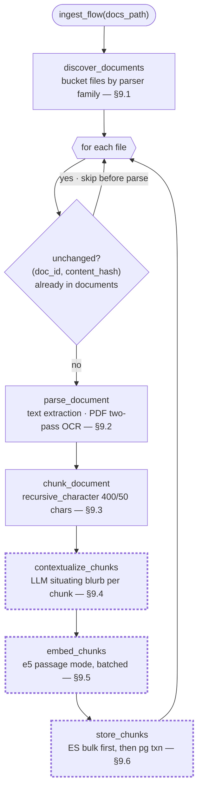
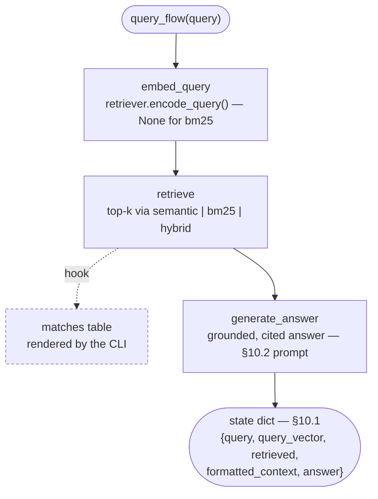
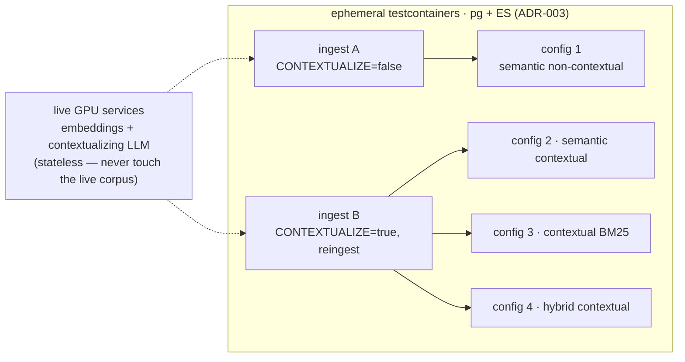

# Pipelines

Both pipelines are Prefect flows (`varagity/pipeline/`) whose stages run as
tracked task runs — state, duration, retries, and logs per stage at the
Prefect UI (`http://localhost:4200`). Business logic lives in the plain
modules; the flow layer is thin `@task` adapters, so the same code runs with
or without Prefect.

## Prefect posture

- **Flows run in-process** from the CLI — no worker, deployment, or schedule
  (spec §21 #8). Every `ingest`/`chat`/`eval` invocation creates flow runs
  against the compose `prefect` server (SQLite-backed, ADR-003).
- **`PREFECT_API_URL` is exported before `prefect` is imported**
  (`varagity/pipeline/__init__.py`): Prefect captures its environment at
  import time, so a later export would be silently ignored. With no server
  reachable, Prefect 3 falls back to an ephemeral in-process API — host runs
  without the stack still work, just untracked.
- **Result caching is disabled on every task** (`NO_CACHE`): the stages are
  side-effecting calls against live services with unhashable inputs (store
  clients, progress displays); Prefect's default input-hash policy would log
  an error per run and a cache hit could never be correct.
- **Flow parameter validation is off** (`validate_parameters=False`): tests
  and the eval harness inject duck-typed store/client fakes that pydantic's
  is-instance validation would reject.

## Ingestion flow (`ingest`)

The three model/store stages (dashed border) carry Prefect `retries=2`;
discovery/parse/chunk are local and deterministic, so they carry none (below).

- **One orchestration loop.** The loader (`varagity/ingest/loader.py`) owns
  the loop — idempotency skip, empty-extraction guard, per-file failure
  containment, `original_index` allocation — and invokes each stage through
  an `IngestStages` seam. The flow passes `@task`-wrapped equivalents of the
  same stage functions through the same loop, so plain and tracked execution
  cannot drift.
- **Retries in two layers, different scopes.** The model/store clients retry
  transient HTTP failures *within* one call (`tenacity`); the
  contextualize/embed/store **tasks** carry `retries=2` with exponential
  backoff to re-run the whole stage after the client gives up — e.g. an
  Elasticsearch restart mid-ingest. Both store writes are idempotent, so a
  stage re-run is safe. Discovery/parse/chunk are local and deterministic;
  retrying them cannot help, so they carry none.
- **Failure containment.** One file raising is logged, counted (`failed` in
  the summary table), and visible as a failed task run — it never aborts the
  corpus. A file with no extractable text gets a 0-chunk `documents` row and
  a dedicated summary count (never silently dropped).
- **Ordering inside `store_chunks`**: Elasticsearch bulk first, pgvector
  transaction last — the pg `documents` row is the idempotency marker, so a
  failure in between leaves the file re-attemptable (see
  [Data model](data-model.md#idempotency-re-ingestion-semantics)).

## Query flow (`query`)

Returns the spec §10.1 state dict:
`{query, query_vector, retrieved, formatted_context, answer}`.

- **Query embedding is its own tracked stage** via the retrievers'
  `encode_query()` seam; the vector is handed to `retrieve` so nothing is
  encoded twice. For `bm25` it is `None` (nothing to encode).
- **No Prefect-level retries** on the query path: it is interactive, the
  clients already retry transient HTTP failures internally, and stacked
  backoff would multiply the wait before a hard failure surfaces at the
  prompt.
- Measured overhead of flow tracking: ≈0.06 s against a ~7.5 s question —
  LLM generation dominates.

## Evaluation flows

Thin flows (`eval-matrix`, `eval-ocr`) over the spec §16 harness
(`varagity/eval/`); each eval ingest is a tracked **subflow** with per-stage
task runs.

- **`eval-matrix`** (`main.py eval`): recall@k / pass@k (k ∈ {5, 10, 20})
  across the four-configuration ladder — (1) semantic non-contextual,
  (2) semantic contextual, (3) contextual BM25, (4) hybrid contextual. Two
  ingests into **ephemeral testcontainers stores** cover all four configs
  (ingest A non-contextual → config 1; ingest B contextual, reingest → configs
  2–4); embeddings and the contextualizing LLM are the live GPU services
  (stateless). The live corpus is never touched (ADR-003).
- **`eval-ocr`** (`main.py eval ocr`): the OCR engine benchmark behind
  ADR-004 — per engine: CER/WER against the fixtures' known ground truth,
  pages/sec, and (supplementary) retrieval recall on the scanned-doc golden
  queries with the engine as the only variable.

How `eval-matrix` covers all four configs with only two ingests into the
throwaway stores:

Results are rendered as `rich` tables and persisted as timestamped JSON under
`data/eval/results/` (gitignored) for regression comparison. Metric
semantics: `recall@k` is the cookbook's headline number (per-query fraction
of golden chunks in the top-k, averaged); `pass@k` is the strict complement
(share of queries with **all** golden chunks in the top-k).

!!! note "The fixtures corpus saturates the matrix"
    At 16 chunks, k ≤ 20 ≥ corpus size, so every config scores 1.000 at
    k ∈ {10, 20} — the harness is proven, but the numbers only become a
    quality signal on a larger corpus. The planned follow-up is the Anthropic
    cookbook dataset (737 chunks / 248 queries), which needs a pre-chunked
    ingest path and a second golden loader (plan Phase 9, note #8).

## CLI entry points

| Command | Flow(s) | Behavior |
|---|---|---|
| `uv run main.py ingest [--reingest]` | `ingest` | One tracked ingest run; exit 1 if any file failed |
| `uv run main.py chat` *(default)* | `ingest`, then `query` per question | Spec §13 startup sequence: ingest first, then the Q&A loop (`:quit` exits) |
| `uv run --group eval main.py eval` | `eval-matrix` (+ ingest subflows) | 4-config retrieval matrix on ephemeral stores |
| `uv run --group eval main.py eval ocr` | `eval-ocr` (+ ingest subflows) | OCR engine benchmark (CER/WER, pages/s, recall) |
