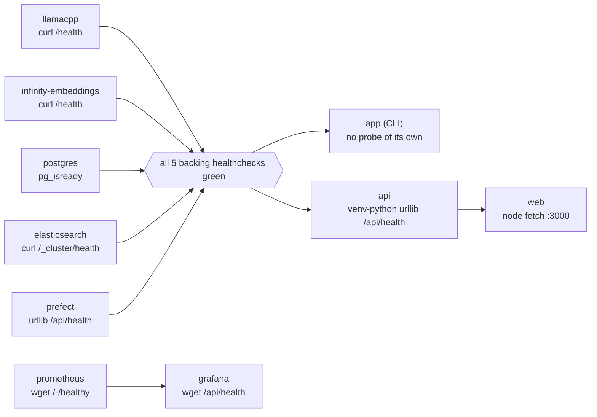
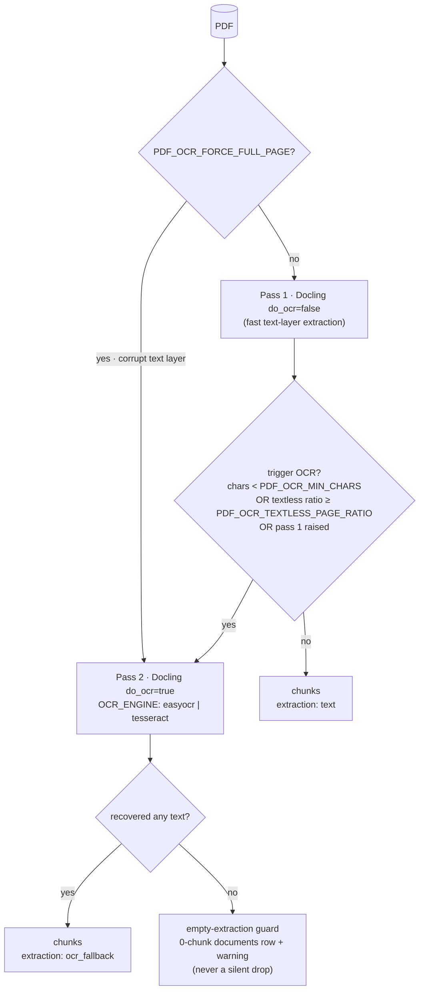

# Runbook

Operating the Varagity stack: from clean clone to answered question — in the
terminal or the browser — plus the operational gotchas collected while
building it.

## Prerequisites

- **Docker + Docker Compose**, with the **nvidia-container-toolkit** runtime
  configured (the README has step-by-step Debian instructions).
- **An Nvidia GPU setup** matching the compose GPU pinning (see
  [GPU & VRAM](#gpu-vram) — this repo's config assumes two GPUs).
- **≥ 12 GB free disk** for images/volumes — and note Elasticsearch's disk
  watermarks ([below](#elasticsearch-notes)): a host disk > 90% full will
  break indexing outright.
- **Model files on the host** (never copied into images):
    - `${models_volume}/<BASE_MODEL>` — the llama.cpp `.gguf` chat model.
    - `${embeddings_volume}/multilingual-e5-large-instruct/` — the
      [intfloat/multilingual-e5-large-instruct](https://huggingface.co/intfloat/multilingual-e5-large-instruct)
      snapshot (its ONNX weights ship upstream; the infinity `optimum` engine
      serves them).
    - `${embeddings_volume}/bge-reranker-v2-m3/` — the
      [BAAI/bge-reranker-v2-m3](https://huggingface.co/BAAI/bge-reranker-v2-m3)
      snapshot **plus a pre-exported ONNX model under `onnx/`** (e.g. via
      `optimum-cli export onnx`): the `optimum` engine does not auto-export
      from safetensors, and the container serves both models
      ([why the reranker is here](#the-reranker-rides-the-embedding-container)).

## First-time setup

```bash
git clone https://github.com/luisegarduno/varagity && cd varagity
cp .env.example .env
```

Edit `.env`:

1. Point `models_volume` / `embeddings_volume` at your host model directories
   and set `secret_infinity_key` / `POSTGRES_PASSWORD`.
2. Set `BASE_MODEL` to your `.gguf` filename.
3. Leave the service URLs at their **in-container** values (`http://llamacpp:8080/v1`
   etc.) — the checked-in convention is container values with host overrides
   in comments ([host-vs-container](#host-vs-container-env-usage)).
4. Browsing from another machine? Put this host's LAN address in
   `NEXT_PUBLIC_API_URL` *and* add that origin to `API_CORS_ORIGINS`
   ([web: dev vs prod](#web-app-dev-vs-prod)).

Put some documents in `./docs/` (the gitignored ingest corpus — **not**
`golden-docs/`, which is this documentation) — or upload them from the
browser in a minute — then:

```bash
docker compose up -d --wait     # exits 0 once every healthcheck is green
bash scripts/smoke.sh           # 10 sequenced checks across the default stack
```

Either front-end works from here:

- **Browser** — open `http://localhost:3000`: upload documents on the corpus
  page, run the ingest with live per-stage progress, and ask; answers arrive
  with citation chips and the evidence panel.
- **Terminal** — `docker compose logs -f varagity` shows the `app` container
  ingest, then prompt. It runs `chat` non-interactively (ingests, prints the
  prompt, exits on stdin EOF); for an interactive session run the CLI
  attached, or [from the host](#host-vs-container-env-usage):

```bash
docker compose run --rm app uv run main.py chat
```

Ask something answerable from your corpus; you should get a grounded answer
citing its `[SOURCE]`. `:quit` exits the CLI loop.

## Bring-up order & healthchecks

`docker compose up -d --wait` handles ordering across the **ten default
services** (two more are profile-gated, below): `app` and `api` declare
`depends_on: condition: service_healthy` on all five backing services, `web`
waits on `api`, `grafana` on `prometheus`, and `--wait` blocks until every
healthcheck is green. What "healthy" means per service:



| Service | Probe | Semantics to know |
|---|---|---|
| `llamacpp` | `curl /health` | Returns **503 while the model loads** (~30 s for the current 9B `.gguf`); the generous `retries: 20` covers it. Also unprioritized under load — a busy server can look slow to probe. |
| `infinity-embeddings` | `curl /health` | `/health` is **not** under the `/v1` prefix (API routes are). First boot may re-optimize ONNX graphs, which takes a minute. |
| `postgres` | `pg_isready` | `schema.sql` runs on **first boot only** (empty data dir); everything newer arrives via the API's migration runner ([below](#volumes-and-resets)). |
| `elasticsearch` | `curl /_cluster/health` | Reachability only — **single-node clusters are `yellow` by design** (replicas can never assign). Never gate on `green`. |
| `prefect` | python-urllib `/api/health` | The image ships no `curl`/`wget`, hence the stdlib probe. |
| `api` | venv-python urllib `/api/health` | Same no-curl posture. `/api/health` answers **200 whenever the process is alive** — per-dependency state rides in the body, and each probe refreshes the `varagity_dependency_up` gauge. Startup applies pending SQL migrations first. |
| `web` | node `fetch(':3000')` | Alpine image, no curl — node's global `fetch`. `NEXT_PUBLIC_API_URL` was baked at **build** time ([below](#web-app-dev-vs-prod)). |
| `prometheus` | busybox `wget /-/healthy` | Busybox-based image — `wget --spider`. |
| `grafana` | busybox `wget /api/health` | Waits on `prometheus`; the datasource + dashboards are provisioned from read-only mounts at boot. |

Two optional services are **profile-gated** — off by default, and enabling
one needs no config edits ([observability](#observability-operations)):

```bash
docker compose --profile prefect-exporter up -d   # flow/task-run metrics polled from the Prefect API
docker compose --profile gpu-metrics up -d        # dcgm-exporter: GPU VRAM/utilization
```

`prefect-exporter` exposes no host port (Prometheus scrapes it in-network at
`prefect-exporter:8000`); `dcgm-exporter` reserves **all** GPUs and runs with
`cap_add: SYS_ADMIN` (DCGM's documented posture).

`scripts/smoke.sh` then verifies substance, not just liveness — ten
sequenced checks over the default stack: (1) every container's health state
(nine healthchecked services; `app` has no probe), (2) llama.cpp serves
`/health` and `/v1/models` lists `BASE_MODEL`, (3) infinity answers on its
interface-specific bound port and returns a 1024-dim embedding, (4) the pg
schema — `vector` extension, `documents`/`chunks`, all three chunk indexes,
**and the five migration-runner tables** (`conversations`, `messages`,
`message_sources`, `app_settings`, `schema_migrations` — proof the API's
startup migrations ran), (5) ES cluster health yellow/green, (6) Prefect
`/api/health`, (7) the API reports every dependency reachable and serves
`/openapi.json` plus the `varagity_*` metric families at `/metrics`, (8) the
web app answers on `:3000`, (9) Prometheus is healthy with the
`varagity-api` scrape target `up`, (10) Grafana is healthy and the anonymous
search API lists the three provisioned dashboards.

## Day-to-day usage

```bash
uv run main.py ingest              # ingest DOCS_PATH into both stores
uv run main.py ingest --reingest   # delete + re-process every discovered doc
uv run main.py chat                # ingest, then the Q&A loop (the default)
uv run main.py -v 2 chat           # verbose: full chunk/retrieval panels
uv run --group eval main.py eval       # 5-config retrieval matrix + chunker sweep
uv run --group eval main.py eval ocr   # OCR engine benchmark
```

**The browser flow** is the same pipeline without a terminal: at
`http://localhost:3000`, upload files (`POST /api/documents`, per-file cap
`UPLOAD_MAX_MB`, landing in the same `./docs` corpus), run the ingest with
live per-stage/per-chunk progress (`POST /api/ingest` — the same tracked
flow on a background thread), and ask. Prefer it for ingests you want on the
Grafana Ingestion dashboard ([per-process
metrics](#observability-operations)).

Every UI in one place:

| Surface | URL |
|---|---|
| Web GUI (chat · evidence · corpus · settings) | `http://localhost:3000` |
| HTTP API (OpenAPI at `/openapi.json`) | `http://localhost:8000` |
| Prefect UI (flow/task runs) | `http://localhost:4200` |
| Prometheus | `http://localhost:9090` |
| Grafana dashboards | `http://localhost:3001` |

**`--reingest` semantics**: idempotency keys on file *bytes*
(`content_hash`), so pipeline-setting changes (`CONTEXTUALIZE`, chunk params,
`OCR_ENGINE`) do **not** mark files as changed — unchanged files are skipped
until you `--reingest`. It clears each document from **both** stores first,
keeping them consistent. Re-ingesting from the GUI additionally clears the
stale flag ([below](#runtime-settings-the-stale-corpus-flag)); the CLI
variant does not.

**Retrieval method** is an env toggle:
`RETRIEVAL_METHOD=semantic|bm25|hybrid|reranked` (default `hybrid`) — or
flip it live from the GUI settings drawer, no restart. Handy for A/B-ing a
query that one method struggles with.

## Runtime settings & the stale-corpus flag

The GUI's settings drawer writes through `PATCH /api/settings` (spec_v2
§4.7): overrides persist in the `app_settings` table, are merged over the
env-loaded `Settings`, and are re-loaded on API startup — they survive
restarts and take precedence over `.env`. `GET /api/settings` reports the
effective values plus the stale flag.

- **Query-time knobs** — `RETRIEVAL_METHOD`, `TOP_K`, the fusion weights,
  the rerank toggles, `LLM_TEMPERATURE`, `MAX_TOKENS`, `CHAT_MODEL_TYPE` —
  take effect on the **next question**. No restart, no reingest.
- **Ingest-time knobs** — `CHUNKING_STRATEGY`, `CHUNK_SIZE`/`CHUNK_OVERLAP`,
  `CONTEXTUALIZE`, `OCR_ENGINE` — don't change content hashes, so changing
  one while documents are ingested flags the corpus **stale**, and the GUI
  shows a persistent "re-ingest to apply" affordance.
- **Only a *completed* API-driven `reingest=true` run clears the flag.** A
  CLI `uv run main.py ingest --reingest` re-processes the corpus but runs in
  another process and cannot clear it; patching a setting back to its old
  value doesn't clear it either — the flag records "the corpus may not match
  the current settings", not a diff. When in doubt, run the GUI reingest
  once.
- The settings routes need postgres (structured `503 postgres_unreachable`
  when it's down); unknown or invalid keys are a structured `422`.

## Host-vs-container `.env` usage

The single `.env` is consumed twice — Docker Compose interpolates
`${lowercase}` vars into service definitions, and the app loads the same file
via pydantic-settings. The checked-in values are the **in-container** ones
(service names: `http://llamacpp:8080/v1`). When running the app on the
**host** (dev loops, tests, eval), override the endpoints per run:

```bash
BASE_MODEL_API_URL=http://localhost:8080/v1 \
POSTGRES_HOST=localhost \
ELASTICSEARCH_URL=http://localhost:9200 \
PREFECT_API_URL=http://localhost:4200/api \
EMBEDDING_API_URL="http://$(docker compose port infinity-embeddings 8081)/v1" \
RERANK_API_URL="http://$(docker compose port infinity-embeddings 8081)/v1" \
DOCS_PATH=./docs \
uv run main.py chat
```

(`RERANK_API_URL` is only consulted by the `reranked` method — same infinity
address as the embeddings.)

The **API** runs on the host the same way — the uvicorn factory plus the
same overrides:

```bash
BASE_MODEL_API_URL=http://localhost:8080/v1 \
POSTGRES_HOST=localhost \
ELASTICSEARCH_URL=http://localhost:9200 \
PREFECT_API_URL=http://localhost:4200/api \
EMBEDDING_API_URL="http://$(docker compose port infinity-embeddings 8081)/v1" \
RERANK_API_URL="http://$(docker compose port infinity-embeddings 8081)/v1" \
DOCS_PATH=./docs \
uv run uvicorn varagity.api.main:create_app --factory --port 8000
```

A host API applies the startup migrations and loads persisted setting
overrides exactly like the container. Mind the ports: with the compose `api`
service up, host `:8000` is already taken — `docker compose stop web api`
first (stopping `web` too keeps `:3000` free for the dev server,
[below](#web-app-dev-vs-prod)), or pick another `--port`.

!!! warning "infinity's host binding is interface-specific"
    The compose maps infinity to `192.168.86.21:8081`, not `0.0.0.0` — plain
    `localhost:8081` does **not** reach it from the host. Resolve the bound
    address with `docker compose port infinity-embeddings 8081` (as above and
    in `scripts/smoke.sh`).

## Web app: dev vs prod

**`NEXT_PUBLIC_API_URL` is a build-time constant.** Next.js inlines
`NEXT_PUBLIC_*` values into the compiled bundle; compose passes it as a
**build arg** (default `http://localhost:8000`). Consequences:

- Editing it in `.env` does nothing to an already-built image — run
  `docker compose build web && docker compose up -d web`.
- It is the **browser's** route to the API, not the container's: browsers on
  other machines need this host's LAN address in `NEXT_PUBLIC_API_URL`
  (rebuild) **and** that origin added to `API_CORS_ORIGINS` (API restart) —
  two knobs, both required.

The dev loop skips the image entirely (`web/` is bun-only — never
npm/yarn):

```bash
cd web
bun install
NEXT_PUBLIC_API_URL=http://localhost:8000 bun run dev   # http://localhost:3000
```

pointed at the compose `api` or a [host-run
API](#host-vs-container-env-usage). Free the port first
(`docker compose stop web`): the dev server must own `:3000`, which is also
the only origin `API_CORS_ORIGINS` allows by default. `bun run test` (Vitest
unit), `bun run lint`, `bun run build`, and `bun run gen:types` (regenerates
`lib/types.ts` from the running API's OpenAPI schema — generated, never
hand-edited) round out the toolchain.

**bun is the package manager, not the runtime.** Node executes everything —
`next`, `vitest`, and `playwright` run under Node via their shebang scripts
(`bun run <script>` merely launches them; no `--bun`, no `bun test`). The
bun version pin lives in two places: the `web/Dockerfile` base stage
(`oven/bun:1.3.14-alpine`) and `.github/workflows/ci.yml`
(`bun-version: 1.3.14`) — bump both together. Installs are fast even cold:
a fresh-cache `bun install --frozen-lockfile` measured ~3.2 s for 779
packages (bun 1.3.14, 2026-07-15), versus tens of seconds under the
previous package manager
([ADR-005 amendment](adr/ADR-005-web-stack-and-api.md#amendment-2026-07-15-v3-phase-1)).

## The opt-in e2e harness

`web/e2e/` holds Playwright specs (smoke, keyboard, chat flow, axe
accessibility) that exercise the **real stack** — deliberately no
`webServer` block in `playwright.config.ts`, so nothing is started for you:

```bash
docker compose up -d --wait
bun --cwd web run e2e         # or: cd web && bun run e2e
```

- **Browser binaries are an explicit step**: run
  `bunx playwright install --with-deps` once per machine — no lifecycle
  script installs them (playwright@1.61.1 ships no `scripts` field at all),
  so this is a documented setup step, not an install side-effect.
- Targets `http://localhost:3000` (which must reach the API on `:8000`);
  `PLAYWRIGHT_BASE_URL` overrides the base URL.
- **Serial on purpose** (`fullyParallel: false`, `workers: 1`): the backend
  is single-user — one conversation store, one GPU — so parallel specs would
  race each other's state. Generation on the local GPUs runs 30–90 s per
  answer; the per-test timeout is 120 s.
- **Read-only toward the corpus**: the specs chat and drive the UI; they
  never upload, delete, or reingest, so a developer corpus survives a run.
- Testing a **dev build**: the dev server must own `:3000` (stop the compose
  `web` first) — `API_CORS_ORIGINS` allows only that origin, so any other
  port fails CORS before it fails a test.
- Each spec runs twice: desktop chromium (1280×800) and mobile chromium
  (390×844, touch).

## Volumes and resets

| Volume | Holds | Reset effect |
|---|---|---|
| `pgdata` | pgvector data — the ingested corpus + metadata, conversations, runtime setting overrides | re-runs `schema.sql` on next boot; the API re-applies all migrations on its next startup |
| `esdata` | the BM25 index | index recreated on next ingest |
| `model_cache` | Docling layout/table models + EasyOCR weights (`~/.cache`, shared by the `api` and `app` containers) | re-downloads on next PDF parse |
| `prefect` | the Prefect server's SQLite backing store | run history lost |
| `prometheus_data` | scraped time-series history | metric history lost — dashboards start empty |
| `grafana_data` | Grafana's internal state (sessions, preferences) | harmless — the datasource + dashboards re-provision at boot |

`docker compose down -v` drops all of them — the full factory reset.

### Schema migrations run on API startup

`schema.sql` is the **fresh-install fast path**: postgres runs it on first
boot only (empty data dir). Everything newer — `conversations`, `messages`,
`message_sources`, `app_settings` — arrives as ordered, idempotent SQL in
`varagity/stores/migrations/NNN_*.sql`, tracked in `schema_migrations` and
applied by the **API on startup**, one transaction per file (a failing
migration rolls back atomically and is retried next boot). Consequences:

- **Upgrading a live v1 `pgdata` volume needs no `down -v`**: the next `api`
  boot applies the v2 tables; the ingested corpus survives in place.
- **The CLI never runs migrations.** CLI ingest/chat only touch the
  `schema.sql` tables, so they work regardless — but the conversation and
  settings routes need the migrated tables, so bring `api` up at least once.
- If postgres is unreachable at API startup, the runner logs and skips (boot
  proceeds; postgres-backed routes answer structured `503`s until it's
  back); an actual SQL failure fails startup loudly.
- Keep `schema.sql` and the migrations in sync: fresh installs take the fast
  path, live volumes take the runner.

!!! warning "Postgres credentials freeze at first boot"
    The `pgdata` volume keeps the password from **first boot**. Editing
    `POSTGRES_PASSWORD` in `.env` later changes what clients *send* but not
    what the server *expects* — host TCP connections start failing auth while
    `docker compose exec postgres psql` (trust-based local socket) still
    works, which is confusing to debug. Fix: `ALTER USER varagity WITH
    PASSWORD '…'` inside the container, or `docker compose down -v` to
    re-initialize.

## GPU & VRAM

**There is no VRAM isolation between containers** — both GPU services see
real device memory, so the total must fit. Current topology on this host:

| GPU | Card | Service | Steady-state VRAM |
|---|---|---|---|
| 0 | RTX 2080 Ti (22.5 GB) | `llamacpp` | ~9.0 GB (MoE experts offloaded to CPU) |
| 1 | RTX 5060 (8 GB) | `infinity-embeddings` | e5 + reranker ONNX, batch-capped to fit |

Pinning gotchas learned the hard way:

- **infinity's `optimum` engine ignores `INFINITY_DEVICE_ID`** — pin at the
  Docker layer with `device_ids: ["1"]` in the compose reservation. Inside
  the container the visible device is then `0`, which is what
  `INFINITY_DEVICE_ID` is set to.
- **`llamacpp` uses `count: 1`**, which grabs the first GPU (device 0).
- The llama.cpp command keeps `-ot ".ffn_(up|down)_exps.=CPU"` — the
  configured `BASE_MODEL` is a MoE model, and this offloads expert FFN
  weights to CPU. It is why an ~9B Q8 model fits in ~9 GB, and also why
  **prompt evaluation is noticeably slower than decode** (~54 tok/s decode;
  slow prefill is the CPU-offload signature, not a bug).

The optional `gpu-metrics` profile turns this table into a live dashboard —
per-card VRAM/utilization in Grafana ([below](#observability-operations)).

### The reranker rides the embedding container

`bge-reranker-v2-m3` is served by the **same** infinity instance
(semicolon-separated multi-model syntax) and exposed at `/v1/rerank` — and
since v2 it is **wired into the query path**
([ADR-006](adr/ADR-006-reranking-wired.md), spec_v2 §5):
`RETRIEVAL_METHOD=reranked` over-fetches `RERANK_CANDIDATES` candidates from
`RERANK_BASE_METHOD`, cross-encodes them here, and keeps `RERANK_TOP_N`.
`RERANK_ENABLED=false` is a **kill switch, not a method**: `reranked` then
degrades to its base method's ranking (and logs it) — the toggle and method
selection are deliberately orthogonal. Operational facts:

- **The engine must stay `optimum`** on this GPU: the image's torch build has
  no CUDA kernels for the 5060's Blackwell `sm_120` and crashes at warmup;
  onnxruntime works.
- **The ONNX must be pre-exported** into the model dir (`onnx/model.onnx`);
  `optimum` does not export from safetensors at serve time.
- **`INFINITY_BATCH_SIZE: '32;4'`** caps the reranker's batch at 4 — the
  default 32 OOMs an 8 GB card on a single ~2.2 GB attention buffer at
  warmup. Order matches `INFINITY_MODEL_ID` (e5 first).
- **GPU pinning happens at the Docker layer** (`device_ids: ["1"]`) because
  the `optimum` engine ignores `INFINITY_DEVICE_ID` ([above](#gpu-vram)).
- **Only a served cross-encoder is valid at `/rerank`** — infinity
  structurally rejects bi-encoders (e5, jina) there, and the rerank client
  surfaces that as a clear, non-retryable error instead of backing off into
  it. Never point `RERANK_MODEL` at an embedding model.
- **Measured cost: ≈0.66 s per query** for the default 40-candidate pool on
  this card — charted as the `rerank` stage on Grafana's Query dashboard.

## First-run model downloads

Beyond the bind-mounted LLM/embedding models, three things download on first
use and are cached afterwards:

- **Docling layout/table models** → `~/.cache/huggingface` (first PDF parse).
- **EasyOCR weights** → pinned to `~/.cache/docling/models/EasyOcr` by our
  engine factory (first OCR fallback).
- **tiktoken's `cl100k_base`** ranks file (first token count; if it can't
  download, counting degrades to a chars/4 estimate with a warning — ingest
  never fails on it).

In-container, the `model_cache` volume (mounted over `/home/user/.cache` in
**both** the `app` and `api` containers — CLI- and GUI-triggered ingests
share one cache) covers the first two, so they survive rebuilds. Expect the
first PDF ingest to be minutes slower than steady state.

## Containers & file permissions

Both Python images (`Dockerfile`, `Dockerfile.api`) run as a non-root `user`
whose uid/gid come from build args **defaulting to 1000** — the typical
single-user host account. This matters twice:

- **`./docs` is a host-owned bind mount the API must write** (uploads,
  per-document delete): a mismatched uid turns every upload into `EACCES`.
  On a host where `id -u` isn't 1000, rebuild with

    ```bash
    docker compose build --build-arg APP_UID=$(id -u) --build-arg APP_GID=$(id -g) api app
    ```

- **`api` and `app` share the `model_cache` volume**, so their uids must
  agree — always override both images together.

Both images also ship the `tesseract` binary (EasyOCR arrives as a Python
dependency of Docling), so either OCR engine works from either front-end.

The `api` container runs a **single uvicorn worker** by design:
process-local state (the in-memory ingest runner, the Prometheus registry)
stays coherent, and `/metrics` needs a single-process registry. Scale with
container replicas, not `--workers`.

## OCR fallback operations

PDFs take a fast text-layer pass first; OCR (pass 2) triggers automatically
when a document yields < `PDF_OCR_MIN_CHARS` non-whitespace chars, has
≥ `PDF_OCR_TEXTLESS_PAGE_RATIO` textless pages, or pass 1 raised. Chunks
recovered this way carry `extraction: "ocr_fallback"` provenance
(`SELECT ... WHERE metadata->>'extraction' = 'ocr_fallback'`).



- Engines: `OCR_ENGINE=easyocr` (default — ADR-004) or `tesseract`. CPU-only
  by design; throughput measured at ~0.10 pages/s (EasyOCR) vs ~0.55
  (Tesseract) — acceptable because only textless documents pay it, in offline
  batch ingestion.
- Both images install both engines
  ([containers](#containers-file-permissions)), so switching `OCR_ENGINE`
  from the GUI settings drawer works too — like any ingest-time knob, it
  flags the corpus stale
  ([above](#runtime-settings-the-stale-corpus-flag)).
- Only PDFs ever OCR: the office/web parsers reuse the same Docling core but
  their text is digital by construction (spec_v2 §8).
- `PDF_OCR_FORCE_FULL_PAGE=true` is the escape hatch for **corrupt-text-layer**
  PDFs (garbage embedded text passes the content triggers by definition): it
  skips pass 1 entirely and OCRs every page.
- A PDF where even OCR recovers nothing ends in the empty-extraction guard: a
  0-chunk `documents` row, a warning, and a summary count — never a silent
  drop.

## Elasticsearch notes

- **`yellow` is healthy** on this single-node cluster; only `red` is a
  problem.
- **Disk watermarks**: with the host disk > 90% full, ES's default
  *percentage-based* watermarks refuse to allocate new primary shards — the
  cluster goes `red` and every write hangs until timeout. The compose service
  deliberately keeps the default watermarks (they protect the data volume);
  free host disk instead. The **ephemeral testcontainers** stores used by
  tests/eval set `cluster.routing.allocation.disk.threshold_enabled=false` —
  throwaway containers must never depend on host disk pressure.
- The ES **client major version must match the server major** (9.x ↔ 9.x);
  the dependency is pinned `elasticsearch>=9,<10` accordingly.

## Prefect

- UI at [http://localhost:4200](http://localhost:4200): one flow run per
  ingest/question/eval — from the CLI **and** the API alike (peers over the
  same flows, spec_v2 §4.9) — with per-stage task runs, durations, and logs.
- Backing store is the default **SQLite** in the `prefect` volume (ADR-003) —
  fine for a single-user dev stack; the official Postgres+Redis compose is a
  production posture this stack doesn't need.
- Flows run **in-process** from both front-ends; there are no workers,
  deployments, or schedules to manage.
- `PREFECT_API_URL` must be in the environment **before** `prefect` is
  imported (Prefect captures it at import time). The app handles this itself
  (`varagity/pipeline/__init__.py`); it only bites if you script against the
  modules directly.
- The API's **chat preflight deliberately excludes prefect**: with no server
  reachable, Prefect 3 falls back to an ephemeral in-process API and
  questions still answer — untracked, not failed.
- Orchestration-level metrics (run/state counts) come from the optional
  `prefect-exporter` profile ([below](#observability-operations)).

## Observability operations

App metrics flow api → Prometheus → Grafana; everything is provisioned —
`docker compose up` yields working dashboards with zero click-ops (spec_v2
§6, [ADR-007](adr/ADR-007-observability-stack.md)).

- **Prometheus** (`http://localhost:9090`, host port `PROMETHEUS_PORT`)
  scrapes `api:8000/metrics` every 15 s. The optional exporters' targets sit
  in the scrape config permanently: while a profile is disabled its target
  simply reports `up == 0` — enabling `--profile prefect-exporter`
  (flow/task-run metrics polled from the Prefect API, 60 s interval) or
  `--profile gpu-metrics` (DCGM, 30 s) needs no config edit.
- **Grafana** (`http://localhost:3001`, host port `GRAFANA_PORT`; the
  container serves 3000) is fully provisioned: one Prometheus datasource
  (uid `prometheus` — the dashboard JSON references it by uid; keep it) and
  three dashboards — **Query**, **Ingestion**, **Infra** — loaded from
  `observability/grafana/dashboards/` (mounted `:ro`, folder *Varagity*, UI
  edits disabled — edit the JSON and restart grafana instead). **Anonymous
  read-only viewing is enabled** (org role `Viewer`), so dashboards render
  without a login; the image-default `admin/admin` stands for edits — dev
  posture ([below](#security-posture-dev-only)).
- **`METRICS_ENABLED` gates the `/metrics` route only** — the collectors
  always record. `false` removes the route (404; Prometheus shows the
  `varagity-api` target down) without touching any pipeline code.
- **Metrics are per-process.** The collectors live in whatever process runs
  the flow: a **CLI ingest records into its own short-lived process and
  never reaches the scrape** — run ingests through the GUI/API
  (`POST /api/ingest`) to populate the Ingestion dashboard. Same for
  queries: CLI chat is invisible to Grafana; API chat is charted.
- **dcgm-exporter consumer-card caveat**: several DCGM fields (profiling
  metrics especially) come back empty on GeForce parts — this host's
  2080 Ti / RTX 5060 included. Blank panels there are the cards, not broken
  wiring.

## Security posture (dev-only)

This stack is a **single-user development posture** — do not expose it:

- Elasticsearch runs with `xpack.security.enabled=false` (no auth, no TLS).
- PostgreSQL uses a static password from `.env`.
- llama.cpp is unauthenticated (`BASE_MODEL_API_KEY` is a placeholder the SDK
  requires).
- infinity has an API key (`secret_infinity_key`) but no TLS; its host
  binding is at least interface-specific.
- The **API** is plain HTTP, unauthenticated, and single-user by design;
  CORS restricts *browsers* to `API_CORS_ORIGINS` (the local web app), but
  any LAN client can call `:8000` directly.
- **Grafana** keeps the image-default `admin/admin` with anonymous read-only
  viewing enabled; **Prometheus** has no auth at all.

## Performance expectations

Numbers from this host (see [ADRs](adr/index.md) and eval results for
context):

| Operation | Observed |
|---|---|
| llama.cpp model load | ~30 s |
| Chat decode | ~54 tok/s (slow prefill = MoE CPU-offload signature) |
| Contextualization | ~8 s/chunk (one LLM call per chunk, per-document prompt-cache grouping) |
| Fixtures corpus ingest (16 chunks) | ~42 s non-contextual; ~3 min contextual |
| OCR fallback | ~0.10 pages/s EasyOCR / ~0.55 pages/s Tesseract (CPU) |
| Cross-encoder rerank | ≈0.66 s per query for the 40-candidate pool (RTX 5060, ONNX) |
| Query (hybrid, top-10) | ~7.5 s, LLM generation dominated; Prefect overhead ≈0.06 s |

## Troubleshooting quick reference

| Symptom | Likely cause → fix |
|---|---|
| `llamacpp` unhealthy for ~5 min after up | Model still loading (503 is normal); check `docker compose logs llamacpp` for the `.gguf` load line |
| Host psql auth failures, but `compose exec postgres psql` works | Password drift — `pgdata` keeps the first-boot password ([above](#volumes-and-resets)) |
| ES `red`, ingest hangs/times out | Host disk > 90% (watermarks) — free disk; testcontainers are immune by config |
| `localhost:8081` unreachable | infinity binds a specific interface — `docker compose port infinity-embeddings 8081` |
| infinity crashes at warmup after GPU/engine changes | torch has no `sm_120` kernels — keep `INFINITY_ENGINE=optimum`; reranker OOM → keep the `32;4` batch cap |
| Config change didn't take effect on ingest | Content hashes unchanged — run `ingest --reingest` (or the GUI's stale-banner action) |
| GUI upload fails; `EACCES` in `api` logs | uid mismatch on the `./docs` mount — rebuild with the `APP_UID`/`APP_GID` build args ([above](#containers-file-permissions)) |
| Ingestion dashboard stays empty after a CLI ingest | Metrics are per-process — run the ingest through the GUI/API ([above](#observability-operations)) |
| Changed `NEXT_PUBLIC_API_URL`, browser still calls the old origin | Build-time constant — `docker compose build web && docker compose up -d web` |
| Browser on another machine gets CORS errors | That origin must be in `API_CORS_ORIGINS` *and* baked into `NEXT_PUBLIC_API_URL` ([above](#web-app-dev-vs-prod)) |
| `POST /api/ingest` answers 409 | One run at a time — watch `GET /api/ingest/status`, retry once it's terminal |
| First PDF ingest very slow | One-time Docling/EasyOCR model downloads ([above](#first-run-model-downloads)) |
| Flow runs missing from the Prefect UI (host run) | `PREFECT_API_URL` not set for the process — pass the localhost override |
